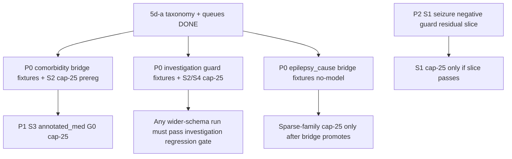

# ExECT S1–S3 Residual Targeted Actions (Phase 5d-a → Axis 3 Queue)

Date: 2026-05-21  
Status: No-model action designs ready for preregistration / fixture tests  
Parent plan: `docs/workstreams/hybrid/hybrid_pipeline_exploration_implementation_plan_20260521.md` §5d-a  
Evidence: `docs/experiments/exect/exect_s1_s3_residual_qualitative_queue_and_taxonomy_20260521.md`  
decision_scope: **operational** (routes work; does not mechanism-close ladder mechanisms)

## Question

Given S1–S3 full-validation residuals, what **family-specific** Axis 3 actions should be preregistered next — mirroring Phase 5d (S4 medication guard design, frequency repair prereg, sparse-family policy)?

**Do not** treat pooled ladder micro F1 as one optimization objective. **Do not** rerun rejected arms (S1 H2 pre-vocab, S4 H1 broad MT classifier, E3–E5 det hints) without new `implementation_variant` IDs.

---

## Residual class → targeted action map

| Priority | Residual class | Levels | Support | Design doc | Proposed mechanism | Cap-25 first? |
| ---: | --- | --- | --- | --- | --- | --- |
| **P0** | Comorbidity surface / atomization | S2–S4 | High | [`exect_s2_comorbidity_surface_policy_design_20260521.md`](exect_s2_comorbidity_surface_policy_design_20260521.md) | Post `comorbidity_atomization_bridge` tiers | Yes — S2 schema |
| **P0** | Investigation regression guard | S2–S4 | Medium | [`exect_ladder_investigation_regression_guard_design_20260521.md`](exect_ladder_investigation_regression_guard_design_20260521.md) | Post guards: ECG drop, planned-scan, polarity | Yes — S2 or S4 |
| **P0** | Sparse annotation-surface families | S3–S4 | Low (3–8) | [`exect_s3_epilepsy_cause_cui_phrase_bridge_design_20260521.md`](exect_s3_epilepsy_cause_cui_phrase_bridge_design_20260521.md) + [`exect_s4_sparse_family_surface_policy_20260521.md`](exect_s4_sparse_family_surface_policy_20260521.md) | CUIPhrase bridges before model sweeps | **No** — fixtures only until bridge exists |
| **P1** | Annotated medication precision drift | S3–S4 | High | [`exect_s3_annotated_medication_precision_guard_design_20260521.md`](exect_s3_annotated_medication_precision_guard_design_20260521.md) | Shared non-ASM + brand tiers with S4 MT track | Yes — S3 then S4 |
| **P1** | Seizure legacy / schema-drift surfaces | S1–S4 | High | [`exect_ladder_seizure_surface_regression_design_20260521.md`](exect_ladder_seizure_surface_regression_design_20260521.md) | Post negative guard + existing bridge coarsening | Yes — S1 residual slice |
| **P2** | S1 seizure modifier / uncertainty leakage | S1 | Low | [`exect_s1_seizure_modifier_negative_guard_design_20260521.md`](exect_s1_seizure_modifier_negative_guard_design_20260521.md) | Drop standalone `secondary`; differential context guard | Residual slice before cap-25 |
| **—** | Diagnosis specificity / collapsed gold | S1–S3 | Low | — (hold) | Regression queue only; no broad recall prompt | No model spend |
| **—** | Missing-gold medication (EA0078, EA0100) | S1–S2 | — | — | Document as gold-quality caveat; exclude from guard training | No |

**S4 parallel tracks (5d, already designed):** medication temporality G0–G3 (`exect_s4_medication_precision_guard_design_20260521.md`), frequency structured slots (hold inconclusive), sparse policy memo (done).

---

## Recommended execution order

1. **No-model:** `epilepsy_cause` bridge fixture tests (queue EA0150, EA0016, EA0137).
2. **Cap-25:** S2 comorbidity atomization bridge (C0 vs C1 tiers).
3. **Cap-25:** Investigation regression guard on S2 frozen baseline.
4. **Cap-25:** S3 annotated medication G0 (non-ASM) — coupled read with S4 MT G0.
5. **Residual slice:** S1 seizure modifier guard (6-doc queue) before any S1 cap-25.
6. **Defer:** S1 diagnosis recall prompts; S3 pooled-micro prompt churn.

---

## Comparison groups (planned naming)

| Group ID | Schema | Varied factor | Baseline anchor |
| --- | --- | --- | --- |
| `exect_s2_comorbidity_surface_bridge_gpt_cap25_v1` | `exect_s2_field_family` | `implementation_variant` | `…231223Z` |
| `exect_ladder_investigation_guard_gpt_cap25_v1` | S2 or S4 | `implementation_variant` | S2 `…231223Z` / S4 `…071248Z` |
| `exect_s3_annotated_medication_guard_gpt_cap25_v1` | `exect_s3_field_family` | `implementation_variant` | `…235439Z` |
| `exect_s1_seizure_modifier_guard_gpt_residual_slice_v1` | `exect_s0_s1_field_family` | `implementation_variant` | `…221944Z` (6-doc subset) |
| `exect_s3_epilepsy_cause_bridge_fixtures_v1` | — | fixtures only | no model |

---

## Gates (shared across ladder Axis 3 cells)

| Gate | Rule |
| --- | --- |
| Primary metric | Per-family F1 (or precision for precision guards) on preregistered split |
| Regression guard | No ≥2pp drop on **frozen** investigation, diagnosis, seizure_type vs level baseline |
| S2→S3→S4 widen | Comorbidity + investigation guards must pass before claiming S3/S4 prompt wins |
| Mechanism closure | `decision_scope: arm` per tier; class stays open until ≥2 implementations agree |
| Gold-quality | Exclude `missing_gold` and `specificity_collapsed` docs from guard training |

---

## Open cells

- Whether S2 comorbidity atomization runs on S3 nine-family pass in same prereg or sequential
- Qwen ports only after GPT cap-25 + full-validation winner per family
- Coupling annotated_medication guard with S4 MT G0 in one inspection vs separate

## References

- Residual syntheses: `exect_s1_residual_error_analysis_20260521.md`, `exect_s2_residual_error_analysis_20260521.md`, `exect_s3_residual_error_analysis_20260521.md`
- Negative probes: `exect_negative_probe_synthesis_20260520.md`
- S4 targeted actions: `exect_s4_medication_precision_guard_design_20260521.md`, `exect_s4_sparse_family_surface_policy_20260521.md`
