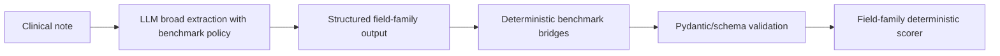
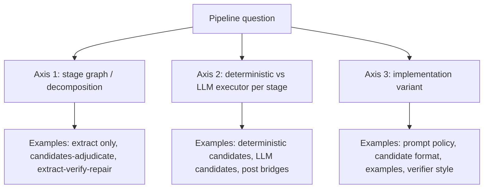

# Core Research Questions Pipeline Review

Date: 2026-05-24  
Status: source-backed research report  
Decision scope: synthesis, not scorer change, loader change, registry edit, or benchmark reproduction claim  
Cursor SDK use: `docs/workstreams/cursor_sdk/archive/experiments_cursor_sdk_drafts/20260524T084403Z_paper_synthesis_draft.md` was used as a review-only source-finding aid, then claims were checked against primary docs, registry rows, and promoted syntheses.

## Executive Answer

This project now has a clear answer to the three core questions, but the strength of that answer differs by dataset.

| Question | Gan S0 frequency | ExECT broad phenotyping |
| --- | --- | --- |
| 1. Best decomposition? | Decompose around temporal candidate discovery before adjudication. The current best operational graph is deterministic candidate building -> LLM adjudication/extraction -> deterministic normalization/scoring/evidence checks. | Use a single broad LLM extraction pass for the core S1/S4 family views, with benchmark policy supplied during extraction and deterministic bridges after extraction. Do not split by section/family by default. For S5, pause before model grids until frequency candidate recall improves. |
| 2. Best deterministic/LLM mix? | Deterministic code should own temporal candidate recall, canonical frequency normalization, schema validation, and scoring. The LLM should own semantic adjudication among candidates and evidence quote generation. | The LLM should own clinical span/family interpretation. Deterministic code should own schema constraints, benchmark bridges, label-policy alignment, scoring, and targeted post bridges. Static pre-hints and generic repair are not the default. |
| 3. Where should components take place? | Put deterministic temporal structure before the LLM and deterministic normalization after the LLM. Avoid tool-during ReAct as the current default. | Put benchmark policy during extraction and bridges after extraction. Avoid broad static pre-vocabulary lists, section-aware pre-filtering, and second-pass verify-repair unless a new preregistered implementation changes the tested mechanism. |

The short version: **Gan is now a deterministic-candidate plus LLM-adjudication problem; ExECT is still primarily an LLM broad-extraction problem with deterministic benchmark-alignment infrastructure.** The same hybrid doctrine applies to both, but the best placement differs because the bottlenecks differ.

## Source Base

Primary sources for this report:

| Source | Role |
| --- | --- |
| `docs/outline.md` | Original research plan and benchmark motivation. |
| `docs/planning/kanban_plan.md` | Current steering board, operational defaults, and active blockers. |
| `docs/workstreams/hybrid/hybrid_pipeline_research_pivot_20260521.md` | Three-axis doctrine: decomposition, deterministic/LLM placement, implementation variant. |
| `docs/workstreams/hybrid/hybrid_pipeline_mechanism_status_20260521.md` | Current operational freezes, arm rejects, and open mechanism classes. |
| `docs/workstreams/hybrid/hybrid_component_taxonomy_decision_20260520.md` | Hybrid taxonomy and interleaving vocabulary. |
| `docs/experiments/synthesis/experiment_registry.json` | Current 204-row experiment registry. |
| `docs/experiments/synthesis/core_research_questions_experiment_source_index_20260524.md` | Generated appendix listing every registry experiment row with run IDs, configs, decision docs, and artifact paths. |
| `docs/experiments/synthesis/paper_synthesis_update_20260524.md` | Post-builder-gap paper-facing synthesis. |
| `docs/experiments/exect/exect_s1_pipeline_decomposition_audit_20260524.md` | Reconciled ExECT S1 Axis 1/2 evidence. |
| `docs/experiments/exect/exect_s4_s5_frequency_gold_template_audit_20260524.md` | ExECT S4/S5 frequency candidate recall audit. |
| `docs/experiments/gan/gan_s0_candidate_builder_gap_v1_gpt_full_validation_rerun_inspection_20260523.md` | Verified Gan GPT builder-gap full-validation result. |
| `docs/experiments/gan/gan_s0_candidate_builder_gap_v1_qwen35b_full_validation_inspection_20260523.md` | Gan Qwen builder-gap transfer result. |

Every registry experiment is source-indexed in `docs/experiments/synthesis/core_research_questions_experiment_source_index_20260524.md`. That file is generated from the registry and should be treated as the traceability appendix, not a separate evidence authority.

## Diagrams

### Current Best Gan S0 Pipeline

This is an H2/H4 pattern: deterministic preconditioning plus LLM adjudication, followed by deterministic normalization and evaluation. It is not just a better prompt.

### Current Best ExECT S1/S4 Pattern

This is mostly L1 plus H1: constrained LLM extraction, benchmark policy during extraction, and deterministic post bridges. The winning S1 shape is not section splitting, static candidate injection, or verify-repair.

### Three-Axis Interpretation Frame

The main interpretive failure in earlier work was mixing these axes. A failed implementation variant does not reject the whole mechanism class.

## What We Know

### Gan S0 Frequency

The strongest current Gan result is the candidate-builder gap v1 program. The GPT 4.1-mini full-validation rerun on `gan_2026_fixed_v1:validation` scored 80.6% monthly accuracy, 86.0% Purist, 88.6% Pragmatic, 100.0% schema validity, and 100.0% evidence support. It is now the Gan S0 operational default (`docs/experiments/gan/gan_s0_candidate_builder_gap_v1_gpt_full_validation_rerun_inspection_20260523.md`; `docs/planning/kanban_plan.md`).

The Qwen3.6:35b transfer of the same builder-gap surface scored 70.7% monthly, 83.2% Purist, 90.6% Pragmatic, 99.3% schema validity, and 99.7% evidence support on 299 predicted records with 297 valid-scored records. This clears the local transfer gate but does not equal the hosted GPT monthly result (`docs/experiments/gan/gan_s0_candidate_builder_gap_v1_qwen35b_full_validation_inspection_20260523.md`; `docs/experiments/synthesis/paper_synthesis_update_20260524.md`).

Older temporal-candidates plus verify-repair runs remain important history but are superseded operationally. They established that temporal preconditioning helped, but the builder-gap work showed that candidate recall itself was the large remaining bottleneck. The interpretation therefore changed from "temporal candidates roughly match verify-repair" to "better deterministic candidate recall materially improves the task."

The stage-graph and executor grids support this direction but do not close every mechanism. Gan Axis 1 remains formally open in `docs/workstreams/hybrid/hybrid_pipeline_mechanism_status_20260521.md`; however, the operational answer is strong enough: use deterministic candidates first and LLM adjudication second.

### ExECT S1

The S1 operational default is GPT 4.1-mini v4_10 plus inline benchmark bridges: 92.3% micro F1 on the 40-record validation split. The cap-25 default is 95.8% micro F1. These are local field-family diagnostics over diagnosis, seizure type, and annotated medication, not full ExECTv2 published-benchmark reproduction (`docs/experiments/exect/exect_s1_pipeline_decomposition_audit_20260524.md`).

The Axis 1 S1 grid was already run. It found that inline bridges and post-module bridges tied at 95.8% cap-25 micro F1; bridge-free verify/repair did not improve over bridge-free single-pass; and family-split/section-aware decomposition regressed to 83.3%. That means the current best decomposition for S1 is still single broad extraction with benchmark bridges, not family splitting or a repair stage.

The Axis 2 S1 executor grid was also already run. Inline LLM extraction with bridges and post-bridge extraction tied at 95.8%. Deterministic hints regressed: all-family hints 90.9%, seizure hints 92.8%, medication hints 93.3%. Static pre-hints therefore should not be repeated without a new implementation variant.

### ExECT S2-S4 and S5

The schema ladder shows a breadth cost: GPT S1 92.3% micro F1, S2 80.9%, S3 72.1%, and S4 65.5% under local field-family diagnostics. This should be described as schema breadth pressure, not as a calibrated learning curve, because each rung changes the field-family set (`docs/experiments/synthesis/experiment_registry.json`; `docs/experiments/synthesis/experiments_methods_results_20260520.md`).

S4 is not solved. Medication temporality, seizure frequency, sparse family scope, and family-specific precision/recall tradeoffs remain live. The S4 cause K0+K1 bridge improved epilepsy-cause F1 and is operationally frozen for S4, but the broader ExECT mechanism question remains open.

S5 is now defined as a reporting/experiment surface over diagnosis, seizure type, annotated medication, investigation, and seizure frequency. It is deliberately not "S4 plus more fields." The current S4/S5 frequency audit found only 5/43 validation gold frequency labels covered by current deterministic candidates, 11.6% gold coverage, and only 2/24 gold-bearing documents fully covered. Therefore, an S5 Axis 1/2 model grid is held until E6 improves deterministic frequency candidate recall (`docs/experiments/exect/exect_s4_s5_frequency_gold_template_audit_20260524.md`; `docs/planning/kanban_plan.md`).

## What We Do Not Know

The unresolved questions are not blank spots; they are controlled open cells.

| Open question | Why it remains open |
| --- | --- |
| Gan optimal stage count | The best operational graph is clear, but stage count has not been mechanism-closed across all reasonable graph variants. |
| Gan LLM candidate generation | One or more LLM candidate formats failed or underperformed, but the class is open until a stricter candidate schema and equal downstream adjudication are tested. |
| Gan tool-during temporal reasoning | ReAct temporal tools failed as an arm; that does not reject every tool-during design. |
| ExECT bridge placement on full validation | Inline and post bridges tied on cap-25, but full-validation bridge-placement isolation is still open. |
| ExECT policy vs bridge causal split | Production S1 bundles benchmark prompt policy and bridges. We know the bundle works; we do not fully know each component's marginal contribution. |
| ExECT broad S5 decomposition | Held because frequency candidates are not recall-safe enough for a fair S5 stage/executor grid. |
| Published benchmark parity | Gan Real(300)/Real(150) access and full ExECT CUI-aware scoring remain blocked/deferred. Local synthetic validation is not published reproduction. |

## Why Confounds Happened

The project moved quickly from initial DSPy extraction to a large matrix of model, schema, prompt, verifier, bridge, and candidate-builder variants. That speed created three common confounds.

First, operational freezes sometimes sounded like mechanism closure. A default such as "Gan F0" or "ExECT S1 v4_10" is a reproducibility anchor, not a proof that all competing mechanisms are exhausted.

Second, many historical runs changed more than one factor: prompt policy, bridge code, candidate source, validation mode, and model track sometimes moved together. The registry now mitigates this by naming `comparison_group`, `varied_factor`, `run_scope`, and `decision_scope`.

Third, cap-25 experiments were sometimes interpreted too strongly. Cap-25 is useful for search and ranking; full validation is needed for operational promotion; test or published-benchmark reporting needs explicit gates.

## Decision Matrix

| Mechanism / design | Current decision | Evidence strength | Notes |
| --- | --- | --- | --- |
| Gan deterministic temporal candidates before LLM adjudication | Operational default | Strong | Builder-gap v1 GPT full validation now leads; Qwen transfer accepted. |
| Gan candidate-builder gap v1 | Operational default for GPT | Strong | 80.6% monthly on full synthetic validation. |
| Gan Qwen builder-gap transfer | Accepted arm | Strong for transfer, not parity | 70.7% monthly and 90.6% Pragmatic; trails GPT monthly. |
| Gan ReAct/tool-during temporal tools | Reject as tested | Arm-level | One tool surface failed; tool-during class remains open. |
| Gan candidate-constrained verifier | Reject as tested | Arm-level | Added complexity without slice lift. |
| Gan targeted examples min7 | Reject as tested | Arm-level | Tied or failed slice controls; examples mechanism remains open. |
| ExECT S1 single-pass LLM plus bridges | Operational default | Strong local validation | 92.3% full validation micro F1. |
| ExECT S1 section/family split | Reject as tested | Arm-level | Regressed in cap-25 grid. |
| ExECT S1 verify-repair | Reject as tested | Arm-level | Did not improve bridge-free baseline and regressed vs production path. |
| ExECT S1 static deterministic hints | Reject as tested | Arm-level | All-family, seizure, and medication hints regressed. |
| ExECT S4 cause K0+K1 bridge | Operational freeze | Strong for target family | Improves cause F1 with regression guards, but does not solve S4. |
| ExECT S4/S5 frequency deterministic candidates | Not ready | Audit evidence | Candidate recall is too low for a fair model grid. |
| DSPy optimizers as replacement for manual policy | Open/deferred | Mixed negative arms | GEPA and bootstrap arms do not yet beat manual architecture/policy. |

## Authoritative Answers

### 1. What is the best way to decompose the task into a pipeline?

For **Gan frequency**, decompose by the temporal reasoning bottleneck. Build temporal candidates deterministically, then ask the LLM to adjudicate the current benchmark-facing frequency, then normalize and validate deterministically. This is the only decomposition with strong current operational evidence.

For **ExECT broad phenotyping**, do not decompose first by sections or field families. The current best S1/S4 pattern is one broad constrained LLM extraction pass, benchmark policy during extraction, and deterministic bridges/scoring after extraction. For S5, the next decomposition should be gated by frequency candidate recall, because frequency is the weak family likely to dominate the value of any new pipeline design.

### 2. What is the best mix of deterministic and LLM components?

For **Gan**, deterministic components should do the high-recall mechanical work: temporal phrase detection, candidate construction, canonical label normalization, schema validation, and scorer interpretation. The LLM should do what rules cannot safely do: select among temporally plausible candidates, apply benchmark policy to ambiguous note context, and produce evidence quotes.

For **ExECT**, deterministic components should enforce benchmark alignment and reproducibility: schema constraints, bridge rules, scorer normalization, and targeted family-specific post-processing where validated. The LLM should remain responsible for broad clinical interpretation and entity/family extraction. Deterministic-only extraction is far below the LLM-plus-policy ceiling, and generic pre-hints have not helped.

### 3. Where in the pipeline should deterministic and LLM components take place?

For **Gan**, deterministic code should enter before the LLM as candidate generation and after the LLM as normalization/validation. The LLM should sit in the middle as adjudicator. Tool-during should be treated as an open mechanism but not the default.

For **ExECT**, benchmark rules should enter during the LLM prompt/policy and after extraction as deterministic bridges. Broad deterministic context filtering or static vocabulary injection before extraction should not be the default. Verify-repair should not be inserted as a routine second pass unless a new arm changes what is being verified or repaired.

## Paper-Safe Claims

The following claims are ready for paper/table work if caveats travel with them.

| Claim | Status | Required caveat |
| --- | --- | --- |
| Gan builder-gap v1 is the best current internal Gan S0 operational surface. | Supported | Synthetic validation, not Gan Real benchmark reproduction. |
| Deterministic temporal candidate recall is a major Gan bottleneck. | Supported | Mechanism is strongly indicated by builder-gap lift but not every candidate-source variant is closed. |
| Qwen can transfer the Gan builder-gap surface, but GPT remains stronger on monthly accuracy. | Supported | Valid-scored denominator differs; transfer success is not parity. |
| ExECT S1 works best as broad LLM extraction plus benchmark bridges. | Supported locally | S1 is only three field families and local scorer semantics. |
| ExECT broad S4 remains substantially harder than S1. | Supported | Family sets differ across rungs; use per-family caveats. |
| ExECT S5 should not spend on model grids until frequency candidate recall improves. | Supported | Based on S4/S5 frequency audit, not on a model-arm comparison. |

## Claims To Avoid

Avoid these statements unless a new source explicitly supports them.

| Unsafe claim | Better wording |
| --- | --- |
| "The optimal Gan stage count is solved." | "The current Gan operational default is candidate-building plus LLM adjudication; optimal stage count remains formally open." |
| "Tool use failed." | "One ReAct temporal tool arm failed; tool-during temporal reasoning remains open." |
| "ExECT deterministic pre-processing does not work." | "Static pre-hints and section/family split arms failed as tested; other pre-context designs remain open." |
| "ExECT S1 is benchmark parity." | "ExECT S1 is strong on the local three-family field view; published full ExECT reproduction remains blocked." |
| "Qwen matches GPT." | "Qwen transfers some surfaces well, especially Gan, but remains task- and family-dependent." |

## Recommended Next Work

1. **Freeze paper result tables from primary artifacts.** Use the registry, run artifacts, and source inspections; do not cite SDK drafts as evidence.
2. **Run ExECT E6 frequency candidate iteration before S5 model grids.** The S4/S5 audit shows current deterministic candidates are not recall-safe.
3. **Run Gan builder-gap residual forensics before more Gan model arms.** Decide whether remaining errors are candidate-recall failures, schema/adjudication failures, or model-specific semantic errors.
4. **Keep mechanism language disciplined.** New reports should state axis, comparison group, varied factor, and decision scope.

## Validation And Traceability

No model calls, scorer changes, loader changes, or registry edits were made for this report. Validation consisted of source review plus a fresh Cursor SDK review-only paper-synthesis run for source discovery:

- SDK sanity check: `uv run python scripts/cursor_sdk_workflows.py check`
- SDK review-only draft: `docs/workstreams/cursor_sdk/archive/experiments_cursor_sdk_drafts/20260524T084403Z_paper_synthesis_draft.md`
- Complete experiment source index generated from `docs/experiments/synthesis/experiment_registry.json`: `docs/experiments/synthesis/core_research_questions_experiment_source_index_20260524.md`

The source index contains all 204 registry experiments: 102 Gan rows and 102 ExECT rows. Main narrative claims in this report should be checked against the cited decision docs before being promoted into a manuscript.
