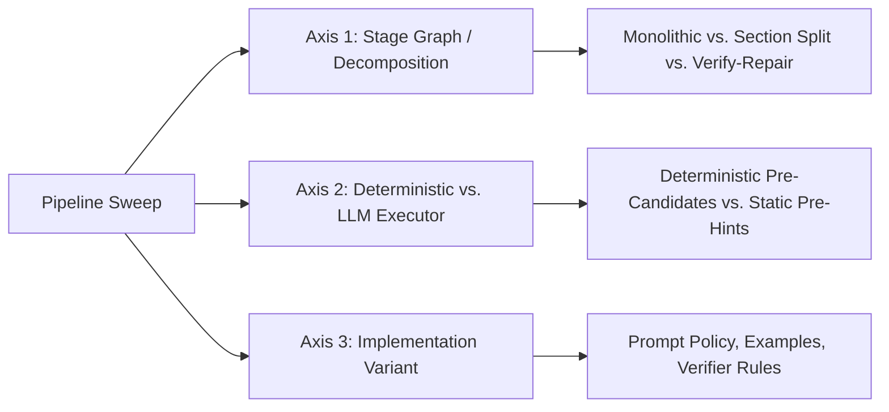

# Clinical Extraction Experimentation Retrospective Report

This report synthesizes the architectural designs, experimental iterations, key decision points, and results of our clinical extraction pipelines on the ExECTv2 and Gan 2026 datasets. The findings are based on extensive sweeps on synthetic validation splits ($N=299$ for Gan, $n=40$ for ExECT) and final frozen test-holdout evaluation runs.

The central retrospective conclusion is now deliberately conservative: the project has produced strong operational defaults, but the next research value is not further polishing those defaults. It is a cleaner ablation program that isolates stage graph, executor placement, and implementation variants. Several prior negative outcomes are arm-level rejections, not mechanism closures.

## Scope And Claim Discipline

The numbers in this report are internal project metrics, not published benchmark parity claims.

* **Gan:** validation rows use the synthetic `gan_2026_fixed_v1:validation` split and the project deterministic scorer. The gold label is `seizure_frequency_number[0]`; `reference[0]` is a secondary diagnostic cross-check only.
* **ExECT:** validation rows use the fixed 40-record `exectv2_fixed_v1:validation` split and deterministic field-family scorers. They are not CUI-aware ExECTv2 Table 1 reproduction.
* **Holdout:** the May 27 frozen holdout results support the promoted architectures but also show a meaningful generalization penalty. They should be reported as one-shot confirmation, not as tuning feedback.
* **Evidence support:** evidence quote support is deterministic quote/source grounding, not clinician-adjudicated correctness.
* **Rejected arms:** rejected components below are rejected as tested (`decision_scope: arm`) unless a mechanism review explicitly says otherwise.

---

## 1. Current Best Architectures

Our architectural convergence is governed by a core hybrid pipeline doctrine: **decompose by the specific task bottleneck, placing deterministic logic where mechanical precision or policy rules rule, and using LLMs for semantic adjudication and clinical context mapping.** This doctrine is an operational guide, not proof that the current stage graph is optimal.

```mermaid
flowchart TD
    subgraph Gan S0 "Gan Seizure-Frequency Architecture"
    A1[Clinical Note] --> A2[Deterministic Temporal Candidate Builders]
    A2 --> A3[Candidate Inventory: Windows, Rates, SF Spans]
    A3 --> A4[LLM Adjudication & Evidence Quote Generation]
    A4 --> A5[Deterministic Frequency Normalization]
    A5 --> A6[Schema Validation & Deterministic Scorer]
    A6 --> A7[Canonical Label / Purist Bucket]
    end

    subgraph ExECT S5 "ExECT S5 Phenotyping Architecture"
    B1[Clinical Note] --> B2[High-Recall Pre-Vocabulary Candidate Hints]
    B2 --> B3[LLM Core S5 Multi-Family Extraction]
    B3 --> B4[LLM Reject-Only v2b Frequency Verifier]
    B4 --> B5[Deterministic medication brand-alias AM Guard]
    B5 --> B6[Deterministic Benchmark Bridges]
    B6 --> B7[Pydantic Validation & Field Scorers]
    end
```

### Gan S0: Candidate-Builder Gap v1
* **Deterministic Temporal Candidates (Pre-LLM):** Scans the clinical note for temporal mentions, dates, seizure counts, and seizure-free intervals, structuring them into a pre-context candidate list.
* **LLM Adjudication & Evidence Quote (GPT-4.1-mini / Qwen-35b):** Evaluates the candidate list against the note context, applies annotation policies (e.g., the 6-month seizure-free threshold), and outputs a raw frequency string and verbatim source quote.
* **Deterministic Frequency Normalization (Post-LLM):** Canonicalizes frequency rates (e.g., "fortnightly" to "1 per 2 week") and calculates the numeric monthly rate and Purist/Pragmatic diagnostic categories.
* **Validation & Scoring:** Enforces schema constraints and matches prediction against the gold label.

### ExECT S1–S4: Monolithic Pass + Post Bridges
* **LLM Broad Extraction:** A single-stage LLM extraction pass is used. The LLM extracts diagnoses, seizure types, and medications in a single pass.
* **Deterministic Post-LLM Bridges:** Remaps clinically accurate but benchmark-incompatible labels (e.g., mapping "focal impaired awareness seizure" to the benchmark-canonical "focal seizure").

### ExECT S5: Promoted Stack
* **High-Recall Pre-Vocab Candidates:** Dynamically injects possible frequency hints into the LLM context to ensure high-recall extraction.
* **LLM Core Extraction (v1.2):** Extracts core diagnosis, medication, seizure type, and investigation fields.
* **Reject-Only v2b Frequency Verifier:** A secondary LLM check enforcing strict temporal/scope rules, rejecting qualitative false positives.
* **AM Guard:** An anti-seizure medication (ASM) guard mapping brand names and aliases to their canonical generic equivalents.
* **Deterministic Benchmark Bridges:** Maps final fields to benchmark-compatible classes.

Important caveat: ExECT S5 is an optimized core-field surface, not a monotonic S1-S4 ladder rung. It includes diagnosis, seizure type, annotated medication, investigation, and seizure frequency, while omitting medication temporality.

---

## 2. Most Important Variations Attempted

We characterized our pipeline sweep space along three distinct axes:



### Axis 1: Stage Graph & Decomposition
* **Monolithic vs. Split by Section/Family:** For ExECT, we attempted to split the task by note sections or field families (e.g., extracting medications and seizure types in parallel). We expected this to reduce context confusion. However, it regressed performance dramatically (micro F1 fell to 65.6% vs. 95.8% for monolithic on S1 cap-25), suggesting that family co-occurrence context is critical for extraction coherence.
* **Verify-Repair Second Pass:** We tested appending a second LLM pass to inspect and repair the JSON output. On ExECT S1, this resulted in a -9.4pp regression, as the second pass frequently over-corrected correct baseline extractions.
* **Untested Stage Graphs:** We have not yet tested a CLINES-style entity-first pipeline: entity tagging first, then normalization/date processing, then attribute extraction into the target schema. This is a major gap because it tests whether broad entity recall should precede benchmark-specific schema filling.

### Axis 2: Deterministic vs. LLM Executor Placement
* **Deterministic Temporal Pre-Candidates vs. LLM-Based Parsing:** For Gan, we compared injecting deterministic candidates (pre-parsed dates and counts) with leaving the LLM to perform raw extraction. Injecting candidate context raised Gan S0 validation accuracy from the mid-60s to **80.6%**.
* **Static Context Pre-Hints:** For ExECT, we tested injecting deterministic pre-hints (e.g., dictionary-matched medications). This regressed F1 (all-family hints fell to 90.9% vs. 95.8% baseline), as the LLM over-relied on the hints and missed novel clinical variants in the text.
* **Untested Temporal Executor Cells:** We have not cleanly isolated specialist date extraction as its own stage. CLINES explicitly separates entity extraction, term normalization, date processing, and attribute extraction; our Gan work has candidate builders, but not a systematic comparison of deterministic date extraction, LLM date extraction, hybrid date resolution, or agent-tool date resolution under the same downstream adjudicator.

### Axis 3: Implementation Variants
* **6-Month Seizure-Free Threshold Rule:** Adding this annotation policy rule directly to the Gan prompt (only label "seizure free" if $\ge 6$ months; otherwise, compute the rate over the window) was the single most impactful prompt adjustment, resolving the largest semantic mismatch between the LLM and the gold labels.
* **Underexplored Compute Allocation:** We have not tested self-consistency, vote/aggregate runs, or variance-aware adjudication. This is a clean way to spend more inference on hard temporal cases without immediately introducing multi-agent orchestration complexity.
* **Underexplained Optimization Runs:** GEPA G1/G2 regressed on GPT-4.1-mini, but the failures are underexplained relative to the mechanism's potential. Qwen-specific GEPA has not been systematically tested, and the GPT runs should be treated as arm rejections until a cleaner optimizer review explains whether the failure was prompt bloat, metric mismatch, stage placement, training-set size, or local/general transfer.

---

## 3. Promising Components That Didn't Make the Cut

We maintained strict **arm-vs-mechanism discipline**, classifying negative outcomes as arm rejections (`decision_scope: arm`) where a specific implementation failed, while keeping the broader mechanism class open.

### Tier 1 Rejections (Highest Priority)

> [!WARNING]
> The following components regressed metrics or significantly increased system latency and were excluded from the final frozen defaults.

| Component | Dataset | Baseline | Experimental Metric | Headline Result | Failure Mode / Rationale |
| :--- | :--- | :--- | :--- | :---: | :--- |
| **Per-Family Parallel Ceiling** | ExECT S5 | v2b Monolithic | Pooled Micro F1 | 83.6% (**-4.6pp**) | Parallel calls regressed seizure types by -11.9pp and introduced **~14x latency**. |
| **Combined Verifier v2** | ExECT S5 | v1 Verifier | Seizure Freq. Recall | 60.0% (**-16.0pp**) | Stacking strict qualitative rules with temporal verifiers collapsed recall. |
| **Temporal Medication Guard** | ExECT S5 | AM Guard | Medication Recall | 79.3% (**-20.7pp**) | Pruning historical/suggested medications was too aggressive and dropped true positives. |
| **High-Precision Candidates** | ExECT S5 | High-Recall | Seizure Freq. F1 | 56.3% (**-4.2pp**) | Restricting context hints dropped qualitative frequency recall by -12.0pp. |
| **Unknown-Overuse Guard** | Gan S0 | Builder-Gap v1 | Monthly Accuracy | 16.0% | Caused massive over-extraction on documents with no frequency reference. |
| **GEPA G1/G2 Optimizers** | Gan S0 | Hand-Written | Monthly Accuracy | 60.0% / 48.0% | DSPy-optimized prompts generated long, overfitted instructions that regressed accuracy. |
| **ReAct/Tool-During Temporal Tools** | Gan S0 | Single-Pass | Monthly Accuracy | 42.9% (slice) | Local Qwen struggled with tool-invocation loop overhead on complex notes. |

---

## 4. Convergence Journey

Our development trajectory progressed through four distinct phases:

```
[Phase 1: Baselines] ────> [Phase 2: Pivot] ────> [Phase 3: Refinement] ────> [Phase 4: Holdout]
Low-60s F1/Accuracy        Three-Axis Hybrid       Post-LLM Guards &         Frozen Confirmation
Naive JSON Extraction      Doctrine Formulated     v2b Verifier Isolated     Plus Split Penalty
```

1. **Phase 1: Naive Baselines & Mismatches (Early-Mid May 2026):**
   Initial extraction runs focused on direct JSON prompting. We suffered from frequent schema validation errors, label granularity mismatches (e.g., clinically accurate ILAE terms failing benchmark matches), and poor temporal reasoning.
2. **Phase 2: The Three-Axis Hybrid Pivot (May 21, 2026):**
   We formulated the hybrid pipeline doctrine. Instead of simple prompt engineering, we isolated candidate builder bottlenecks. This led to the Gan Candidate-Builder Gap v1 architecture, showing that pre-conditioning the context with dates and intervals dramatically improved monthly accuracy.
3. **Phase 3: Guard Refinement and Ablations (May 24, 2026):**
   For ExECT S5, we tested post-extraction LLM verifiers to prune qualitative false positives. While the combined v2 verifier collapsed recall, isolating the temporal rules alone (**v2b isolation**) successfully boosted seizure frequency F1 to **73.9%**.
4. **Phase 4: Frozen Test-Holdout Evaluation (May 27, 2026):**
   We froze our best architectures and evaluated generalizability on completely unseen data. The results supported the promoted architectures, but also showed meaningful split sensitivity:
   * **Monotonicity Confirmed:** The ExECT clean ladder monotonic decline (S1 $\rightarrow$ S2 $\rightarrow$ S3 $\rightarrow$ S4) held firmly.
   * **Selective Qwen Wins, Not Broad Superiority:** On the unseen test-holdout, Qwen-35b out-performed GPT-4-mini on ExECT S5 (**73.3% vs. 69.4% Micro F1**) and Gan S0 Pragmatic category accuracy (**79.7% vs. 77.1%**), while GPT still led Gan monthly frequency accuracy (**65.4% vs. 59.1%**) and several ExECT lower-rung family profiles.
   * **Evidence Quality:** Qwen-35b demonstrated superior evidence quote support rates (88.6% to 95.1%) across all schema ladder levels compared to GPT-4-mini.
   * **Generalization Penalty:** Both model tracks dropped from validation to holdout on Gan monthly frequency and ExECT micro F1. This is a research result in its own right: current defaults are useful, but they are not stable enough to end the ablation program.

---

## 5. Unexplored and Underexplored Areas

Despite useful validation and holdout results, several high-value areas remain open. The main recommendation is to prioritize cleaner ablations over additional default polishing.

### 1. Specialist Date Extraction And Temporal Resolution
Temporal reasoning remains the central Gan bottleneck. The CLINES paper motivates a modular date-processing stage: explicit dates are normalized, relative dates are resolved against note-level anchors, and inferred dates are flagged. We have not yet tested this as a first-class stage.

Needed ablations:
* deterministic date extraction and interval construction;
* LLM-only date/event extraction with structured outputs;
* hybrid merge of deterministic date candidates plus LLM event adjudication;
* agent-loop date tools for resolving relative dates, current/past event status, and seizure-free windows;
* downstream comparison using the same Gan adjudicator and scorer.

This should be the first new Gan ablation family because Gan S0 has not reached a satisfying monthly-accuracy threshold, and errors remain temporally concentrated.

### 2. CLINES-Style Entity-First Pipeline
We have not tested a pipeline that performs broad entity tagging before normalization and final schema filling. A CLINES-like skeleton would be:

```text
note -> entity tags with offsets/context -> normalization/date processing -> attribute extraction -> schema aggregation/scoring
```

This may not beat the promoted monolithic or candidate-builder defaults, but it deserves a full experiment because it tests a distinct hypothesis: schema filling may improve when entity recall, normalization, and attribute extraction are disentangled. For ExECT this could clarify whether early broad tagging helps seizure type, medication, investigation, and frequency families; for Gan it could clarify whether frequency labels fail because the model misses temporal entities/events or because it mis-adjudicates already available candidates.

### 3. Self-Consistency And Variance Measurement
We have not tried self-consistency at all. This is a clean compute-allocation ablation: run the same agent multiple times, aggregate canonical labels or structured fields, and measure both accuracy and response variance. It may improve hard temporal cases, but even if it does not, it gives a direct estimate of model instability by record, label family, and model provider.

Initial design should avoid a large multi-agent system. Start with single-agent repeated sampling on Gan S0 cap-25 and ExECT S5 cap-25, then compare majority vote, confidence-weighted vote, and deterministic tie-break rules. Report extra cost and latency explicitly.

### 4. Proper Tool-During Agent Ablations
Our prior ReAct/tool result is only an arm reject. We have not tested a robust tool suite in the loop. Candidate tools include:

* date normalization and relative-date resolution;
* current vs historical event classification;
* seizure-frequency canonical-label validation;
* medication/entity normalization;
* calculator utilities for rates, clusters, and duration windows.

These should be tested as tool-during ablations, not silently folded into pre/post deterministic code, because the scientific question is whether an agent can use tools when reasoning rather than only receiving deterministic context.

### 5. GEPA And Optimizer Failure Analysis
GEPA G1/G2 regressed on GPT-4.1-mini, but the mechanism is underexplored. At minimum we need an optimizer postmortem that inspects generated instructions, metric alignment, training examples, and output length/cost. After that, Qwen should get a small, preregistered optimizer gate only if the optimizer objective is compact and benchmark-contract aligned. The current evidence rejects specific GPT arms; it does not close optimizer mechanisms.

### 6. Causal Ablation Of Bridges Vs. Prompt Policy
In ExECT, benchmark prompt guidelines and post-extraction bridges were bundled together. We know the combined bundle works, but the precise causal split-and the marginal value of writing complex prompt policies vs. post-extraction mapping code-remains unmeasured.

### 7. Medication Temporality On The S5 Stack
While we introduced the AM Guard for generic alias mapping, medication temporality (distinguishing current, planned, historical, or suggested prescriptions) was excluded from the S5 baseline. A high-precision temporal classifier is needed to re-introduce medication temporality without suffering the recall collapses seen in our Tier 2 arm-reject sweeps.

### 8. Real-World Benchmark Parity
Due to database access limitations, all headline numbers are reported on **synthetic validation and holdout splits**. Parity testing on real clinical letters and CUIs (Concept Unique Identifiers) remains the ultimate validation gate for this system's research utility.

---

## 6. Recommended Next Pull

1. **Preregister a Gan temporal/date-stage ablation grid.** Axis 1/2 first: fixed scorer, GPT-4.1-mini cap-25, same downstream adjudicator, compare deterministic, LLM, hybrid, and tool-during date/event extraction.
2. **Design a CLINES-style entity-first skeleton.** Start with one cap-25 ExECT S5 or Gan S0 gate, with offsets/context preserved and no scorer changes.
3. **Run a self-consistency variance probe.** Use the promoted Gan S0 and ExECT S5 surfaces, repeated sampling, deterministic aggregation, and report accuracy/variance/cost.
4. **Write a GEPA postmortem before new optimizer runs.** Explain the GPT G1/G2 failures and define what a compact Qwen optimizer gate would have to prove.
