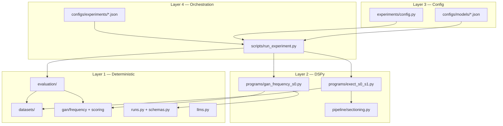

# Codebase Architecture Review

Date: 2026-05-19  
Scope: `src/clinical_extraction/`, `scripts/`, `tests/`, `configs/`  
Related plan: `docs/outline.md` (four-layer architecture)  
Tracker card: `docs/kanban_plan.md` → Backlog → **Consolidate experiment runner and program modules**

## Executive Summary

This repository is a **research codebase in active build-out** (~38 Python modules under `src/`, ~31 test files), not a finished platform. Overall it is **directionally sound and aligned with `docs/outline.md`**, with clear separation between deterministic infrastructure and DSPy programs. The main architectural debt is **concentration in a few very large files** and **dataset branching without a registry**, not a lack of conceptual structure.

| Dimension | Rating | Notes |
| --- | --- | --- |
| Logical layering | **Strong** | Matches the four-layer plan (infra → DSPy → config → orchestration) |
| Modularity | **Good at package level, weak inside programs** | `datasets/`, `evaluation/`, `gan/`, `runs/` are clean; `programs/*` are monoliths |
| DRY | **Mixed** | Shared schemas and run contracts help; orchestration and prediction glue are repeated |
| Best practices | **Strong for research reproducibility** | Frozen Pydantic models, config validation, deterministic scorers, artifact contracts |
| Maintainability risk | **Medium–high** | `gan_frequency_s0.py` (~1,330 LOC), `run_experiment.py` (~750 LOC), prompt/policy text in code |

**Verdict:** The architecture is **clean in intent and boundaries**, but **not yet clean in execution** where research velocity has favored large, dataset-specific modules over shared abstractions.

---

## What Works Well

### 1. Layering matches the research design

The repo implements the outline’s layers in recognizable packages:

| Package / path | Layer |
| --- | --- |
| `data/` + `datasets/` | Layer 1 — loading, splits, manifest |
| `schemas.py`, `runs.py` | Layer 1 — contracts, run tracking |
| `programs/` | Layer 2 — DSPy modules |
| `experiments/config.py` | Layer 3 — typed experiment configs |
| `scripts/run_experiment.py` | Layer 4 — orchestration |
| `evaluation/` | Layer 1 — scoring + error analysis |

`ExperimentConfig` enforces dataset–schema–variant–scorer consistency at load time, which supports reproducible ablations. See `src/clinical_extraction/experiments/config.py` (`validate_experiment_context`).

### 2. Deterministic vs LLM boundaries are respected

- **Gold interpretation** lives in `datasets/exect.py` and `datasets/gan.py` (with audit-aware flags).
- **Scoring** lives in `gan/scoring.py`, `evaluation/exect.py`, `evaluation/evidence.py` — not inside DSPy signatures.
- **Normalization** for Gan is in `gan/frequency.py`, separate from extraction.

This separation is appropriate for clinical extraction research: prompt changes should not silently change benchmark semantics.

### 3. Shared artifact contract

`schemas.py` defines `DocumentPrediction` / `PredictionSet` with dataset-agnostic structure. `runs.py` defines a stable run layout (`metadata`, `config`, `predictions`, `metrics`, `errors`). Tests such as `tests/test_run_artifacts.py` and `tests/test_prediction_schemas.py` lock this in.

### 4. Model/provider abstraction

`llms.py` centralizes provider config, mock adapters for tests, and DSPy LM construction — keeping provider quirks out of programs and scorers.

### 5. Test discipline relative to size

~31 test modules cover loaders, scorers, programs, configs, run lifecycle, and analysis scripts. For a research repo, that is above average and aligned with `AGENTS.md` (deterministic components tested; LLM behavior fixture-driven).

---

## Structural Concerns

### 1. God modules in `programs/`

| File | ~LOC | Responsibilities bundled together |
| --- | ---: | --- |
| `programs/gan_frequency_s0.py` | 1,330 | Signatures, modules, verifier/repair, metrics, GEPA compile, prediction bridge, label repairs |
| `programs/exect_s0_s1.py` | 970 | Signatures, variants, label-policy normalization, prediction bridge |
| `kanban.py` | 789 | Markdown Kanban parser/HTML (project tooling, not extraction) |

This violates single-responsibility at the file level. It is understandable for research iteration (one place to edit prompts + guards + metrics), but it will slow refactors and make parallel work harder.

**Natural split when refactoring:**

- `programs/gan/signatures.py`, `modules.py`, `metrics.py`, `predict.py`
- Same pattern for ExECT
- Move `kanban.py` to `scripts/` or a `tools/` package

### 2. Orchestration logic lives in `scripts/`, not the library

`scripts/run_experiment.py` is the real experiment runner (~750 lines) with many parallel `if dataset == ...` branches for loading, module build, metadata, prompts, predict, evaluate, and summary printing.

That pattern works for two datasets but does not scale. Each new dataset or variant adds another branch chain instead of a registry entry.

**Target shape:**

```python
# conceptual — not implemented
EXPERIMENT_REGISTRY: dict[str, ExperimentBackend] = {
    "gan_2026": GanExperimentBackend(),
    "exect_v2": ExectExperimentBackend(),
}
```

Then `run_experiment.py` becomes a thin CLI over `clinical_extraction.experiments.runner`.

### 3. DRY gaps

**Repeated prediction envelope** — `predict_gan_records` and `predict_exect_records` are nearly identical wrappers around `PredictionSet` construction (`programs/gan_frequency_s0.py`, `programs/exect_s0_s1.py`).

**Duplicated `_evidence_spans`** in both program files.

**Asymmetric evaluation CLI** — `evaluation/cli.py` only supports Gan; ExECT scoring is invoked from `run_experiment.py` via `score_exect_prediction_set`. A unified `evaluate --predictions` for both datasets would complete Layer 1.

### 4. Policy and prompts embedded in Python

Large signature docstrings and tuples such as `EXECT_S0_S1_LABEL_POLICY_GUIDANCE` live inline in program modules. That is fine for version control and tests, but:

- Harder to diff across prompt versions
- Blurs “code” vs “experiment content”
- Makes `programs/*.py` harder to navigate

Consider externalizing prompt packs (e.g. `prompts/gan_s0_v2_4.yaml`) while keeping **deterministic guards** in Python.

### 5. Minor package hygiene issues

- **`kanban.py` in `src/clinical_extraction/`** — useful tooling, but not part of the extraction domain.
- **No `[project.scripts]` entry points** in `pyproject.toml` — experiments run via `python scripts/run_experiment.py` rather than an installed CLI.
- **`clinical_extraction/__init__.py` is empty** — no documented public API surface.
- **`exect-explorer/`** duplicates some evidence-span logic (`exect-explorer/scripts/build_model_overlay.py`).

---

## Alignment with Engineering Best Practices

### Strengths (research-grade)

1. Immutable config models (`FrozenModel`, validated experiment contracts).
2. Explicit metric caveats on runs and configs.
3. Test split guard (`report_on_test_split` must be explicit).
4. Audit-first dataset loading (flags for gold ambiguity, reference disagreement).
5. One-factor-at-a-time experiments supported by JSON configs under `configs/`.
6. Artifact-first workflow (`runs/<id>/` with predictable files).

### Gaps (typical for fast-moving research)

1. No formal plugin/registry for datasets or program variants.
2. Optimizer path only wired for Gan — ExECT cannot use the same compile path without more branching.
3. Large files reduce reviewability and encourage accidental coupling.
4. Core runner logic in `scripts/` rather than importable `src/` (partially mitigated by `tests/test_run_experiment_runtime.py`).

---

## Modular Boundary Map (Current State)



The diagram is **logical**; the weakness is that Layer 4 talks to Layer 2 through many ad hoc switches instead of one backend interface per dataset.

---

## Recommended Refactoring (Prioritized)

Ordered for ROI without blocking active Gan promotion work. See Kanban card for sequencing.

| Priority | Task | Rationale |
| ---: | --- | --- |
| 1 | Extract `clinical_extraction/experiments/runner.py` from `scripts/run_experiment.py`; introduce `ExperimentBackend` protocol | Removes scaling bottleneck before a third dataset |
| 2 | Split `gan_frequency_s0.py` into signatures / modules / optimizer_metrics / predict | Largest file; highest coupling risk |
| 3 | Unify evaluation CLI for Gan + ExECT `PredictionSet` | Completes Layer 1 evaluate path |
| 4 | Shared prediction utilities (`run_records_with_progress`, evidence span helpers) | Low-risk DRY win |
| 5 | Relocate `kanban.py` to `tools/` or `scripts/lib/` | Clarifies package boundary |
| 6 | Add `pyproject.toml` console entry points when runner stabilizes | Ergonomics |

**Do not refactor** scorer semantics, split policy, or `gan_frequency_deterministic_v1` as part of this card — those remain single-threaded per `docs/kanban_plan.md` dependency notes.

---

## Bottom Line

The codebase is **architecturally coherent for a DSPy clinical-extraction research repo**: deterministic core, config-driven experiments, clear dataset modules, and scoring separated from LLM code. It is **not yet DRY or modular at the program/orchestration layer**, where two large files and a branching script carry most of the complexity.

That is a **healthy stage** for active hypothesis testing, but consolidation (registry + split programs + library runner) should complete **before** adding a third dataset or additional ExECT field families — otherwise the `if dataset ==` pattern in `run_experiment.py` becomes the main maintenance bottleneck.

---

## Validation Performed

- Package and file inventory under `src/clinical_extraction/`
- Line counts for largest modules
- Cross-reference with `docs/outline.md` four-layer model
- Grep for dataset branching in `scripts/run_experiment.py` and evaluation entry points
- Review of `ExperimentConfig` validation and run artifact contracts

No code changes were made as part of this review.
