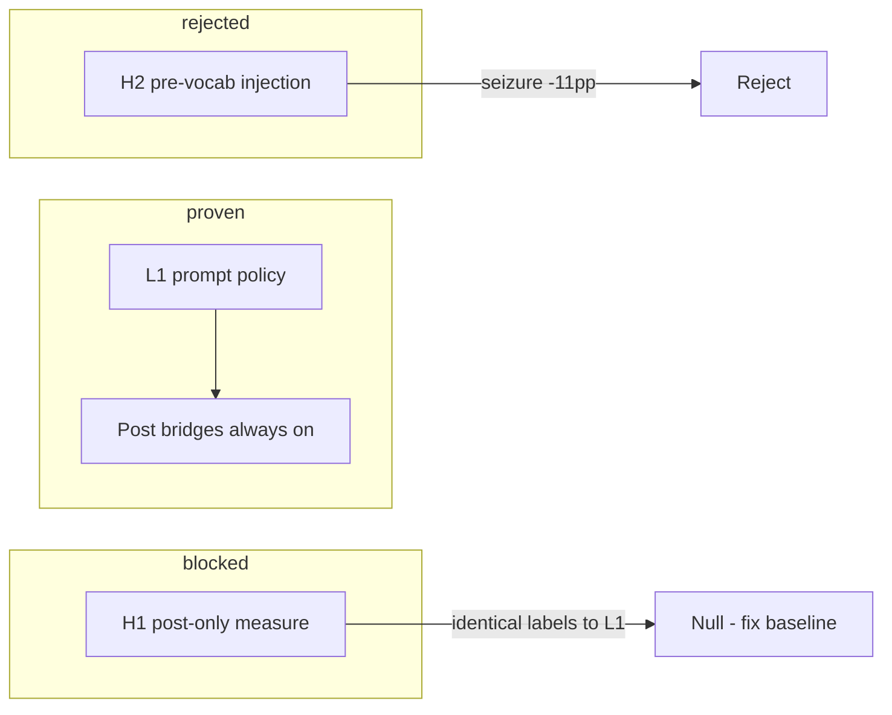

# ExECT Field-Family Deterministic Support Map

Date: 2026-05-20  
Status: Planning artifact (post S1 interleaving GPT phase 1)  
Related: `docs/kanban_plan.md`, `docs/exect_s1_interleaving_gpt_validation_v1_inspection_20260520.md`, `docs/hybrid_component_taxonomy_decision_20260520.md`, `docs/exect_gold_label_audit.md`

## Purpose

This map is the primary ExECT planning artifact after S1 interleaving closed without a promotable arm. It ties **field-family performance**, **existing deterministic roles**, and **candidate interleaving positions** so the next experiments vary one factor at a time.

**Anchors:** frozen L1 single-pass + `_build_s1_field_family_values` benchmark bridges (`exect_s0_s1_field_family_v4_10_label_policy`). GPT exploration model; Qwen for confirmatory ports only.

**Not in scope:** published ExECTv2 Table 1 reproduction (CUI-aware all-family scorer still blocked).

## Metric caveats (read before comparing cells)

| Caveat | Implication |
| --- | --- |
| Pooled micro F1 changes with schema breadth | S1 (3 fam) ≠ S2 (5 fam) ≠ S3 (9 fam) ≠ S4 (11 fam) headlines |
| Benchmark-facing vs clinical richness | Bridges collapse/coarsen for scorer; clinically richer surfaces are not extra gold |
| Cap-25 optimism | Full validation required before promotion; H2 cap-25 masked seizure regression |
| Medication temporality / frequency | S4-only families; S1 interleaving did not test them |
| Gan frequency scaffolding | Gan monthly temporal-candidates promoted; **does not transfer directly** to ExECT prose→gold frequency surfaces |

## Performance anchors (validation 40, frozen programs)

### S1 benchmark-facing families (primary interleaving surface)

| Family | Gold support | GPT F1 (L1 freeze) | Qwen F1 (replication) | Δ (Qwen − GPT) | Run IDs |
| --- | ---: | ---: | ---: | ---: | --- |
| diagnosis | 42 | **93.8%** | 95.1% | +1.3pp | `…221944Z` / `…042117Z` |
| seizure_type | 47 | **90.5%** | **55.7%** | **−34.8pp** | same |
| annotated_medication | 47 | **92.8%** | 89.1% | −3.7pp | same |
| **micro (3 fam)** | — | **92.3%** | 79.0% | −13.3pp | same |

**S1 interleaving phase 1 (GPT, same split/scorer):**

| Arm | Micro | Seizure | Decision |
| --- | ---: | ---: | --- |
| H1 post bridge | 92.3% (0.0pp) | 90.5% | **Hold (null)** — bridges applied in both arms |
| H2 pre vocabulary | 87.5% (−4.8pp) | **79.2%** | **Reject** — seizure regression dominant |

### S2–S4 extension families (ladder context, same 40 records)

| Family | First active | GPT F1 (frozen full) | Qwen F1 (replication) | Notes |
| --- | --- | ---: | ---: | --- |
| investigation | S2 | 90.0% (S2) → **96.7%** (S4 v1.2) | 94.7% (S4) | S3 v1.0 collapse fixed in v1.2+ unknown guards |
| comorbidity | S2 | 69.3% (S2) → 59.8% (S4) | 64.0% (S4) | Overlap policy; cap-25 optimistic |
| annotated_medication | S1→S4 | 90.0% (S2) → 71.3% (S4) | **80.4%** (S4) | S4 scope/precision tradeoff vs S1 |
| seizure_type | S1→S4 | 71.0% (S2) → **84.0%** (S4) | 76.3% (S4) | Qwen weaker at S4 than GPT on seizure |
| diagnosis | S1→S4 | 88.9% (S2) → 91.1% (S4) | 88.3% (S4) | Relatively stable |
| seizure_frequency | S4 | **45.7%** | 50.0% | Top binding gap; Gan monthly ≠ ExECT gold templates |
| medication_temporality | S4 | 62.5% | 69.3% | Recall high, precision low; over-extraction |
| birth_history | S3 | 25.0% (S3) → 23.5% (S4) | 31.6% (S4) | Sparse support (8) |
| onset | S3 | 13.3% (S3) | 0.0% (S4) | CUIPhrase surfaces; very sparse |
| epilepsy_cause | S3 | 11.1% (S3) | 19.0% (S4) | Overlap with comorbidity |
| when_diagnosed | S3 | 28.6% (S3) | 0.0% (S4) | Sparse; surface mismatch |

**Pooled micro (not cross-schema comparable):** S1 GPT 92.3% · S2 80.9% · S3 72.1% · S4 65.5% · S4 Qwen 67.5%.

Registry rows: `exect_s0_s1_validation_full_gpt4_1_mini`, `exect_s2_validation_full_gpt4_1_mini`, `exect_s3_validation_full_gpt4_1_mini`, `exect_s4_validation_full_gpt4_1_mini`, Qwen counterparts.

## Master support map

| Field family | Existing deterministic roles | Candidate knowledge source | Best next interleaving position | Scorer / clinical caveat | Priority probe |
| --- | --- | --- | --- | --- | --- |
| **diagnosis** | Prompt policy; post bridges: uncertainty strip, specificity collapse, co-list augmentation, JME/symptomatic surfaces, seizure-descriptor header suppression | Audited diagnosis vocabulary (`ALLOWED_DIAGNOSIS_LABELS`); gold audit DiagCategory rules | **Post** (measurable only after H1 null fix) or **during** prompt-only | Do not infer epilepsy from seizure type alone; empty-list semantics matter | Low — near ceiling on GPT; Qwen gap smaller than seizure |
| **seizure_type** | Prompt policy; post bridges: fused-phrase split, coarse collapse, JME/GTCS surfaces, secondary token co-list, dissociative suppress, ILAE granularity coarsen | Audited seizure surfaces; **not** MarkupSeizureFrequency spans (audit Bug 1) | **Post** family-specific bridges (already heavy); **avoid** full-note pre-vocab (H2 −11.3pp seizure) | Benchmark coarser than clinical ILAE; plural/singular and “secondary” token FPs common | **High** — largest Qwen gap; H2 proved blind pre-vocab harmful |
| **annotated_medication** | Prompt policy; post bridges: brand preserve, non-ASM reject, surface repair; note-anchored pre-vocab list (`_KNOWN_PRESCRIPTION_MEDICATIONS`) | Rx JSON loader; brand/generic normalization table | **Pre** medication-only candidates (narrow slice) or **post** mapping | Scores annotated prescriptions only; planned/historical not benchmark-facing at S1 | Medium — try **medication-only** H2 slice before any full pre-vocab rerun |
| **investigation** | S2+ `_normalize_investigation_surface`; S4 unknown guard for planned scans; modality+result canonical strings | Investigation modality/result enum; unavailable-results cues | **Post** normalization (proven +10.5pp investigation at S4 v1.2) | Clinical prose (`mri brain normal`) ≠ gold (`mri normal`) | Low for S1 — not in S1 schema; keep S4 guards frozen |
| **comorbidity** | S2 overlap policy; S2 normalization candidate recovery | Comorbidity vs cause overlap table (`exect_s3_phase1_overlap_policy.md`) | **During** prompt priority vs **post** overlap resolver | Same phrase may score in multiple families independently | Medium — S3 cap/full gap; defer until S1 probes settle |
| **medication_temporality** | S4 `format_medication_temporality_label`; pipe-format policy in prompt | Context patterns (“to start”, taper verbs); challenge-set temporality gold (sparse) | **Post** planned/current classifier on Rx spans (Gan-style preconditioning analogue) | Precision collapse from non-ASM and wrong status tags | **High** at S4 — Qwen +6.8pp vs GPT but mechanism is over-extraction |
| **seizure_frequency** | S4 co-label bridges; non-audited period block; prompt quantified/change policy | ExECT MarkupSeizureFrequency templates; optional adapted Gan temporal candidates (monthly **not** gold metric) | **Pre** note-anchored rate candidates + **post** template repair (not Gan monthly scorer) | Qualitative change labels; multi-label blocks; prose≠gold (`seizure free` vs `0 per 3 year`) | **High** at S4 — both models ~50% F1; clearest transfer candidate to adapt |
| **birth_history / onset / when_diagnosed / epilepsy_cause** | S3 bridges; sparse-support prompt examples | CUIPhrase tables from markup files; overlap with comorbidity/cause | **Post** surface canonicalization or **during** few-shot only | Very low support on validation split; not S1 interleaving targets | Low until S4 frequency/temporality probed |

## Deterministic inventory (S1 program — `exect_s0_s1.py`)

| Mechanism | Stage today | Families | Interleaving tag |
| --- | --- | --- | --- |
| `_build_s1_field_family_values` benchmark bridges | Always post-extraction (both L1 and H1) | diagnosis, seizure_type, medication | `H1_post_deterministic` *(intended)* — **not isolated** in phase 1 |
| `build_precomputed_family_candidates` | Pre prompt (H2 only) | all S1 | `H2_pre_deterministic` — **rejected** full validation |
| Prompt label policy v4.10 | During (LLM) | all S1 | `L1_llm_constrained` |
| JSON schema + Pydantic | During output | all | `hard_constraint` |
| Field-family scorer | Eval only | all S1 | `eval_only` |

**Bridge families (representative flags):** fused seizure split, specificity collapse, JME surfaces, diagnosis uncertainty strip, medication brand/ASM repair, co-list augmentation. Full list in `exect_s0_s1.py` (`benchmark_bridge:*`).

## Interleaving lessons (S1 phase 1)

1. **Post bridges are already on the critical path** — measured F1 includes them; moving them later (H1) changed metadata only.
2. **Pre-vocab without family isolation hurts seizure_type** — candidate lists anchor over-specific surfaces.
3. **Qwen seizure gap (−35pp at S1)** suggests deterministic scaffolding may help local models more than hosted GPT — but only after a **clean interleaving comparison** (bridge-free raw scorer path).

## Recommended experiment queue (taxonomy-governed)

| Order | Probe | Comparison group | Varied factor | Gate |
| ---: | --- | --- | --- | --- |
| 1 | **L1 raw vs H1 post bridge** *(complete)* | `exect_s1_interleaving_gpt_validation_v2` | `repair_policy`: `raw_no_benchmark_bridges` vs `artifact_benchmark_bridge_only` | Full: raw 68.6% / H1 92.3% micro; ~24pp bridge effect — `docs/exect_s1_interleaving_gpt_validation_v2_inspection_20260520.md` |
| 2 | **Medication-only pre-vocab slice** *(complete)* | `exect_s1_medication_pre_vocab_slice_gpt_v1` | `H2_pre_deterministic` × medication only | **Reject** H2: 95.1% vs 98.3% medication F1 — `docs/exect_s1_medication_pre_vocab_slice_gpt_inspection_20260520.md` |
| 3 | **S4 seizure-frequency pre candidates** *(complete)* | `exect_s4_frequency_deterministic_v1` | `H2_pre_deterministic` on S4 only | **Reject** H2: 47.1% vs 49.1% seizure_frequency F1 cap-25 — `docs/exect_s4_frequency_deterministic_gpt_inspection_20260520.md` |
| 4 | **Medication temporality post classifier** *(complete)* | `exect_s4_temporality_deterministic_v1` | `H1_post_deterministic` | **Reject** H1 full — `docs/exect_s4_temporality_deterministic_gpt_inspection_20260520.md` |
| 5 | **Seizure-type-only pre-vocab slice** *(complete)* | `exect_s1_seizure_pre_vocab_slice_gpt_v1` | `H2_pre_deterministic` × seizure only | **Reject** H2: 83.3% vs 91.5% seizure_type F1 — `docs/exect_s1_seizure_pre_vocab_slice_gpt_inspection_20260520.md` |
| 6 | **Qwen interleaving v1 (bridge matrix port)** | `exect_s1_interleaving_qwen_validation_v1` | `interleaving_position` (+ cross-track `model_track`) | **Complete — reject port** — full bridge Δ +12.8pp micro vs GPT +23.7pp; H1 null vs Qwen anchor — `docs/exect_s1_interleaving_qwen_validation_v1_inspection_20260520.md` |

**Defer:** H3 tool normalization (Gan ReAct negative control sufficient); full-note H2 rerun; broad S2–S4 architecture ablation.

## Gan → ExECT transfer assessment

| Gan mechanism | ExECT target | Transfer verdict |
| --- | --- | --- |
| Temporal candidate generation before LLM | S4 `seizure_frequency` | **Promising but not direct** — ExECT gold wants `N per period` / change labels, not Gan monthly normalization |
| Verify-repair second pass | S1 diagnosis recall (exploratory slice) | **Optional** — doubles calls; slice-only evidence so far |
| ReAct tools during reasoning | — | **Do not port** — Gan H3 rejected |
| Evidence guard post-pass | All ExECT families | **Already partial** — quote support diagnostic; consider stronger post evidence guard only if F1-neutral |

## Links

- Inspection: `docs/exect_s1_interleaving_gpt_validation_v1_inspection_20260520.md`
- Pre-registration: `docs/exect_s1_interleaving_experiment_preregistration_20260520.md`
- S4 Qwen read: `docs/exect_s4_validation_full_qwen35b_ollama_inspection_20260520.md`
- Label policy skill: `.agents/skills/exect-label-policy-alignment/SKILL.md`
