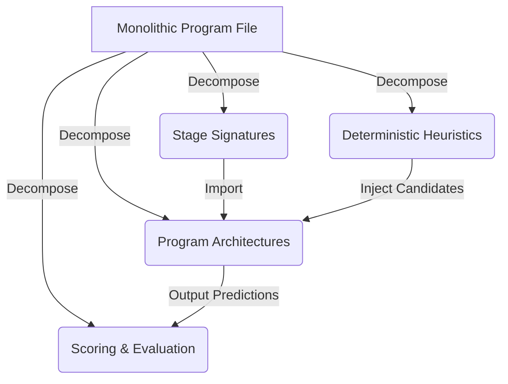

# Modularity Audit & Code Quality Review Report

This report presents a thermonuclear code quality and modularity audit of the clinical extraction research repository. It focuses on identifying monolith risks, assessing structural maintainability, and providing concrete recommendations to simplify and decompose complex program flows into reusable clinical stages.

---

## 1. Executive Summary

While the test suite remains robust and serves as a reliable safety net, the codebase suffers from severe **monolithic program congestion**. The core program files—`gan_frequency_s0.py` and `exect_s0_s1.py`—violate the Single Responsibility Principle (SRP) by combining:
1. **DSPy Signatures** (system prompting, schema definitions, and model parameters);
2. **DSPy Program Modules** (orchestration graphs, direct, parallel, and sequential structures);
3. **Deterministic Heuristics** (regex-based parsers, date math calculators, candidate filters);
4. **Metric Evaluators** (F1 micro/raw scoring, feedback loops, reward formulas);
5. **Optimization Hooks** (compiling pathways, trainset builders).

This tight coupling creates **heuristic test pollution** (where tweaking a string parser breaks unrelated verifier/selector tests) and **path drift hazards** (where archiving experiment configs/runs requires editing path resolution helpers in multiple files).

The proposed remedy is a **Stage-Level Decomposition** that splits these monoliths into clean, decoupled files, standardizes fallback routing for archived files, and mocks candidate boundaries in tests.



---

## 2. Findings & Recommendations

### Finding 1: Monolithic Program Files Exceeding Maintenance Limits [Severity: HIGH]
* **Files Affected**:
  * [gan_frequency_s0.py](file:///c:/Users/cbrow/Code/dspy-extraction/src/clinical_extraction/programs/gan_frequency_s0.py) (~4,233 lines, 196 KB)
  * [exect_s0_s1.py](file:///c:/Users/cbrow/Code/dspy-extraction/src/clinical_extraction/programs/exect_s0_s1.py) (~3,588 lines, 150 KB)
* **Problem**: These files exceed the recommended 1,000-line file size ceiling by 3-4x. They conflate prompt engineering (DSPy Signatures), pipeline routing (DSPy Modules), deterministic parsing (calculators/regexes), evaluation scoring, and compiler/optimizer setup.
* **Impact**:
  * **Cognitive Load**: Reading or refining a single prompt or routing variant requires scanning through thousands of lines of unrelated code.
  * **Git Noise & Merge Conflicts**: Concurrent work on prompting vs compiler pathways leads to constant merge conflicts.
  * **Optimization Risk**: Trivial modifications to helper functions can silently alter runtime characteristics during compiled runs.
* **Proposed Decomposition**:
  * Divide the files into separate modules under their respective domain packages:
    * `src/clinical_extraction/gan/s0/signatures.py`: Exclusively holds DSPy Signatures and system prompting guidelines.
    * `src/clinical_extraction/gan/s0/modules.py`: Orchestrates program flow, direct extraction, verifier graphs, and adjudicator routing.
    * `src/clinical_extraction/gan/s0/heuristics.py`: Holds deterministic builders, calculators, and date-event filters (separating raw extraction from LLM logic).
    * `src/clinical_extraction/gan/s0/optimizer.py`: Handles DSPy compilations, trainset assembly, and GEPA setups.
  * Replicate this package structure for `src/clinical_extraction/exect/s0_s1/`.
* **Reproducibility Preservation**:
  * Retain class names exactly as registered in [program_variant_registry.py](file:///c:/Users/cbrow/Code/dspy-extraction/src/clinical_extraction/experiments/program_variant_registry.py) to prevent breaking historical run replays.

---

### Finding 2: Scattered and Duplicate Archive Fallback Implementations [Severity: MEDIUM]
* **Files Affected**:
  * [config.py](file:///c:/Users/cbrow/Code/dspy-extraction/src/clinical_extraction/experiments/config.py)
  * [registry_validation.py](file:///c:/Users/cbrow/Code/dspy-extraction/src/clinical_extraction/experiments/registry_validation.py)
  * [exect_residual_slice.py](file:///c:/Users/cbrow/Code/dspy-extraction/src/clinical_extraction/evaluation/exect_residual_slice.py)
  * [build_model_catalog.py](file:///c:/Users/cbrow/Code/dspy-extraction/exect-explorer/scripts/build_model_catalog.py)
  * [build_model_catalog_gan.py](file:///c:/Users/cbrow/Code/dspy-extraction/exect-explorer/scripts/build_model_catalog_gan.py)
* **Problem**: Moving older configs and runs to `archive/` folders required adding manual `exists()` checks in multiple loader scripts. This logic is duplicated, slightly inconsistent, and hardcoded.
* **Impact**:
  * **Path Drift**: Reorganizing or pruning the archive directories in the future requires editing path logic across five different files.
  * **Complexity**: Increases the surface area of files that must understand where metadata is stored.
* **Proposed Decomposition**:
  * Introduce central helper functions in [paths.py](file:///c:/Users/cbrow/Code/dspy-extraction/src/clinical_extraction/paths.py):
    ```python
    def resolve_config_path(config_name: str) -> Path:
        """Looks up a configuration file name under active and archived paths."""
        # Try configs/experiments/ first, then archive/configs/
        ...
        
    def resolve_run_directory(run_name: str) -> Path:
        """Looks up a run directory under active runs/ and archived runs/."""
        ...
    ```
  * Replace duplicate fallback logic in all loader modules with calls to these unified helpers.
* **Reproducibility Preservation**:
  * Path resolution will remain transparent to downstream logic, ensuring configs and runs load exactly as they did previously.

---

### Finding 3: Tightly Coupled Test Assertions on Heuristic Output Structures (Heuristic Pollution) [Severity: MEDIUM]
* **Files Affected**:
  * [test_gan_s0_program.py](file:///c:/Users/cbrow/Code/dspy-extraction/tests/test_gan_s0_program.py)
  * [test_gan_temporal_candidates.py](file:///c:/Users/cbrow/Code/dspy-extraction/tests/test_gan_temporal_candidates.py)
* **Problem**: Improving regex candidate inventories in `temporal_candidates.py` directly alters the candidate lists returned during testing. Downstream tests for target selectors and verifiers that assert rigid candidate counts or indices break during parsing improvements.
* **Impact**:
  * **Optimization Friction**: Researchers are hesitant to optimize candidate-recall heuristics because it causes cascading test failures in unrelated downstream module tests.
* **Proposed Decomposition**:
  * Mock out candidate generation functions (such as `build_temporal_frequency_candidates_from_note`) in tests that are verifying downstream *adjudicator* or *selector* logic.
  * Test candidate inventory builders in isolation, separate from selection or scoring.
* **Reproducibility Preservation**:
  * This maintains test isolation without affecting the underlying model output or evaluation scores in real-world runs.

---

## 3. Implementation Roadmap

To decompose these monoliths safely while maintaining a 100% green test suite, the following steps are proposed:

### Phase 1: Unified Path Resolution
1. Add `resolve_config_path` and `resolve_run_directory` to `src/clinical_extraction/paths.py`.
2. Refactor `config.py`, `registry_validation.py`, and catalog builders to use them.
3. Validate by running `pytest tests/test_experiment_configs.py` and `pytest tests/test_experiment_registry_validation.py`.

### Phase 2: Program Deconstruction (exect_s0_s1 & gan_frequency_s0)
1. Split `exect_s0_s1.py` into:
   - `src/clinical_extraction/exect/s0_s1/signatures.py`
   - `src/clinical_extraction/exect/s0_s1/modules.py`
   - `src/clinical_extraction/exect/s0_s1/heuristics.py`
2. Update `exect_s0_s1.py` to simply import from these files, preserving backwards compatibility for imports in `program_variant_registry.py` and other packages.
3. Repeat the same structure for `gan_frequency_s0.py`.
4. Validate that the entire test suite remains completely green.

### Phase 3: Metric Migration
1. Move `gan_frequency_s0_metric` and related synthesis metrics to `src/clinical_extraction/gan/scoring.py`.
2. Move `exect_s0_s1_field_family_micro_f1_metric` to `src/clinical_extraction/exect/scoring.py`.
3. Verify metrics scoring output.

---

## 4. Verification Plan

### Automated Verification
* Run `uv run pytest` to ensure all 1,028 tests pass.
* Verify that program variant instantiations load properly from `PROGRAM_VARIANT_REGISTRY`.

### Manual / Traceability Verification
* Confirm that historical experiment run logs can be re-run with identical results, verifying that no logic, split behavior, or scoring threshold was altered by the decomposition.
