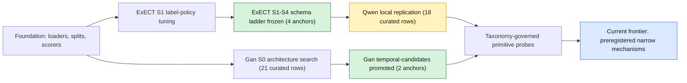

# Research Atlas

Generated: 2026-05-21

This atlas turns the experiment registry into navigable research memory: where the project has been, which hypotheses are anchored or closed, and which paths remain open.

## Source Of Truth

- **Research pivot (doctrine):** `docs/hybrid_pipeline_research_pivot_20260521.md`
- **Mechanism status:** `docs/hybrid_pipeline_mechanism_status_20260521.md`
- **Historical snapshot:** `docs/hybrid_deterministic_placement_research_synthesis_20260521.md`
- Registry: `docs/experiment_registry.json`
- Current operating plan: `docs/kanban_plan.md`
- Matrix export: `docs/experiment_registry_matrix_20260520.md`

## Generated Views

- Journey timeline: `docs/research_atlas/journey.mmd`
- Decision map: `docs/research_atlas/decision_map.mmd`
- Evidence matrix: `docs/research_atlas/evidence_matrix.md`
- Open frontiers: `docs/research_atlas/open_frontiers.md`

## Journey Timeline



## Decision Map

```mermaid
flowchart TD
  gan["Gan S0"]
  exect["ExECT"]
  exect_qwen_replication_validation_v1["exect_qwen_replication_validation_v1\nhold:4\nanchor: micro_f1=79.0%"]
  exect --> exect_qwen_replication_validation_v1
  exect_qwen_s4_cap25_gate_v1["exect_qwen_s4_cap25_gate_v1\nexploratory:1\nanchor: micro_f1=72.4%"]
  exect --> exect_qwen_s4_cap25_gate_v1
  exect_s1_architecture_gpt_cap25_v1["exect_s1_architecture_gpt_cap25_v1\nreject:1, exploratory:2\nanchor: micro_f1=95.8%"]
  exect --> exect_s1_architecture_gpt_cap25_v1
  exect_s1_evidence_policy_gpt_validation_v1["exect_s1_evidence_policy_gpt_validation_v1\nhold:2, reject:1\nanchor: micro_f1=95.8%"]
  exect --> exect_s1_evidence_policy_gpt_validation_v1
  exect_s1_generalization_gpt_test_v1["exect_s1_generalization_gpt_test_v1\nhold:1\nanchor: micro_f1=77.8%"]
  exect --> exect_s1_generalization_gpt_test_v1
  exect_s1_interleaving_gpt_validation_v1["exect_s1_interleaving_gpt_validation_v1\nhold:1, reject:1, exploratory:2\nanchor: micro_f1=92.3%"]
  exect --> exect_s1_interleaving_gpt_validation_v1
  exect_s1_interleaving_gpt_validation_v2["exect_s1_interleaving_gpt_validation_v2\nhold:1, exploratory:3\nanchor: micro_f1=92.3%"]
  exect --> exect_s1_interleaving_gpt_validation_v2
  exect_s1_interleaving_qwen_validation_v1["exect_s1_interleaving_qwen_validation_v1\nhold:2, exploratory:2\nanchor: micro_f1=79.0%"]
  exect --> exect_s1_interleaving_qwen_validation_v1
  exect_s1_medication_pre_vocab_slice_gpt_v1["exect_s1_medication_pre_vocab_slice_gpt_v1\nhold:1, reject:1\nanchor: micro_f1=93.3%"]
  exect --> exect_s1_medication_pre_vocab_slice_gpt_v1
  exect_s1_prompt_policy_gpt_validation_v1["exect_s1_prompt_policy_gpt_validation_v1\nhold:1, reject:1\nanchor: micro_f1=95.8%"]
  exect --> exect_s1_prompt_policy_gpt_validation_v1
  exect_s1_seizure_pre_vocab_slice_gpt_v1["exect_s1_seizure_pre_vocab_slice_gpt_v1\nhold:1, reject:1\nanchor: micro_f1=93.5%"]
  exect --> exect_s1_seizure_pre_vocab_slice_gpt_v1
  exect_s1_verification_gpt_validation_v1["exect_s1_verification_gpt_validation_v1\nhold:1, reject:1\nanchor: micro_f1=95.8%"]
  exect --> exect_s1_verification_gpt_validation_v1
  exect_s4_frequency_deterministic_v1["exect_s4_frequency_deterministic_v1\nhold:1, reject:1\nanchor: micro_f1=69.2%"]
  exect --> exect_s4_frequency_deterministic_v1
  exect_s4_temporality_deterministic_v1["exect_s4_temporality_deterministic_v1\nhold:3, reject:1\nanchor: field_precision.medication_temporality=46.4%"]
  exect --> exect_s4_temporality_deterministic_v1
  exect_schema_complexity_gpt_validation_v1["exect_schema_complexity_gpt_validation_v1\nfreeze:4\nanchor: micro_f1=92.3%"]
  exect --> exect_schema_complexity_gpt_validation_v1
  gan_s0_architecture_gpt_validation_v1["gan_s0_architecture_gpt_validation_v1\npromote:1, superseded:2\nanchor: monthly_frequency_accuracy=65.1%"]
  gan --> gan_s0_architecture_gpt_validation_v1
  gan_s0_architecture_qwen_validation_v1["gan_s0_architecture_qwen_validation_v1\npromote:1, exploratory:1\nanchor: monthly_frequency_accuracy=65.8%"]
  gan --> gan_s0_architecture_qwen_validation_v1
  gan_s0_evidence_policy_gpt_validation_v1["gan_s0_evidence_policy_gpt_validation_v1\nhold:1, reject:2\nanchor: monthly_frequency_accuracy=44.0%"]
  gan --> gan_s0_evidence_policy_gpt_validation_v1
  gan_s0_hard_slice_qwen_architecture_v1["gan_s0_hard_slice_qwen_architecture_v1\nreject:1, exploratory:6\nanchor: monthly_frequency_accuracy=71.4%"]
  gan --> gan_s0_hard_slice_qwen_architecture_v1
  gan_s0_prompt_policy_gpt_validation_v1["gan_s0_prompt_policy_gpt_validation_v1\nhold:2, reject:1\nanchor: monthly_frequency_accuracy=48.0%"]
  gan --> gan_s0_prompt_policy_gpt_validation_v1
  gan_s0_verification_gpt_validation_v1["gan_s0_verification_gpt_validation_v1\nhold:3\nanchor: monthly_frequency_accuracy=44.0%"]
  gan --> gan_s0_verification_gpt_validation_v1
  classDef promote fill:#d8f3dc,stroke:#2d6a4f,color:#081c15;
  classDef freeze fill:#e0f2fe,stroke:#0369a1,color:#0c4a6e;
  classDef hold fill:#fff3bf,stroke:#cc8f00,color:#201400;
  classDef reject fill:#fee2e2,stroke:#b91c1c,color:#450a0a;
  classDef superseded fill:#e5e7eb,stroke:#6b7280,color:#111827;
  classDef exploratory fill:#f3e8ff,stroke:#7e22ce,color:#3b0764;
  classDef pending fill:#f8fafc,stroke:#64748b,color:#0f172a;
  class exect_qwen_replication_validation_v1 hold;
  class exect_qwen_s4_cap25_gate_v1 exploratory;
  class exect_s1_architecture_gpt_cap25_v1 exploratory;
  class exect_s1_evidence_policy_gpt_validation_v1 hold;
  class exect_s1_generalization_gpt_test_v1 hold;
  class exect_s1_interleaving_gpt_validation_v1 hold;
  class exect_s1_interleaving_gpt_validation_v2 hold;
  class exect_s1_interleaving_qwen_validation_v1 hold;
  class exect_s1_medication_pre_vocab_slice_gpt_v1 hold;
  class exect_s1_prompt_policy_gpt_validation_v1 hold;
  class exect_s1_seizure_pre_vocab_slice_gpt_v1 hold;
  class exect_s1_verification_gpt_validation_v1 hold;
  class exect_s4_frequency_deterministic_v1 hold;
  class exect_s4_temporality_deterministic_v1 hold;
  class exect_schema_complexity_gpt_validation_v1 freeze;
  class gan_s0_architecture_gpt_validation_v1 promote;
  class gan_s0_architecture_qwen_validation_v1 promote;
  class gan_s0_evidence_policy_gpt_validation_v1 hold;
  class gan_s0_hard_slice_qwen_architecture_v1 exploratory;
  class gan_s0_prompt_policy_gpt_validation_v1 hold;
  class gan_s0_verification_gpt_validation_v1 hold;
```



## Registry Snapshot

- Curated comparison rows: 63
- Outcomes: promote=2, freeze=4, hold=25, reject=13, superseded=2, exploratory=17
- Schemas: exect_s1=29, exect_s2=2, exect_s3=2, exect_s4=9, gan_s0=21

## How To Read It

- Use the journey timeline for narrative orientation.
- Use the decision map to see which branches are promoted, frozen, held, rejected, or superseded.
- Use the evidence matrix to spot gaps across schema scope and study type.
- Use open frontiers to choose the next concrete pull of work.

Regenerate after registry or Kanban changes:

```powershell
uv run python scripts/export_research_atlas.py
```
