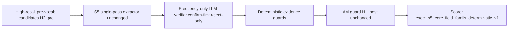

# Cursor SDK Pathway A Card Report

## Card

| Field | Value |
| --- | --- |
| **Card ID** | A2D |
| **Title** | A2 verifier design brief |
| **Lane** | design |
| **Run mode** | **Review-only** — no file edits, no disposable-worktree mutation, no live experiment execution |

---

## Sources Read

| Path | Status |
| --- | --- |
| `docs/experiments/exect/exect_s5_frequency_residual_audit_20260524.md` | Read |
| `docs/planning/kanban_plan.md` | Read |
| `docs/taxonomy/taxonomy_primitive_catalog.md` | Read (verification/evidence primitives section) |
| `docs/workstreams/cursor_sdk/cursor_sdk_pathway_a_implementation_campaign_20260524.md` | Read |
| `docs/experiments/exect/exect_s5_annotated_medication_guard_gpt_inspection_20260524.md` | Read (operational baseline metrics) |
| `docs/experiments/exect/exect_s5_frequency_pre_vocab_high_precision_cap25_gpt4_1_mini_inspection_20260524.md` | Read (rejected pruning arm) |
| `configs/experiments/exect_s5_frequency_pre_vocab_am_guard_full_gpt4_1_mini.json` | Read |
| `configs/experiments/exect_s5_frequency_pre_vocab_am_guard_cap25_gpt4_1_mini.json` | Read |
| `configs/experiments/exect_s5_frequency_pre_vocab_full_gpt4_1_mini.json` | Read |
| `src/clinical_extraction/programs/exect_s4.py` | Read (S5 variant wiring, frequency label policy) |
| `src/clinical_extraction/programs/exect_s0_s1.py` | Read (confirm-first verifier + deterministic guards pattern) |
| `src/clinical_extraction/exect/primitives.py` | Read (high-recall pre-vocab builders) |
| `src/clinical_extraction/experiments/exect_backend.py` | Read |
| `src/clinical_extraction/experiments/config.py` | Read |
| `src/clinical_extraction/programs/gan_frequency_s0.py` | Read (Gan verifier patterns; arm-reject context only) |
| `tests/test_exect_s5_scoring.py` | Read |
| `runs/exect_s5_frequency_pre_vocab_am_guard_cap25_*/metrics.json` | **Missing locally** — cap-25 per-family precision/recall for AM-guard baseline not verified from artifacts in this workspace |

---

## Changes Proposed Or Made

**No changes made** (design lane). Below is the proposed **A2 mission brief** for Codex review before A2I (implementation pilot).

### Hypothesis

A **post-extraction, evidence-sensitive, confirm-first verifier** over the existing high-recall pre-vocab candidate surface can reduce S5 `seizure_frequency` false positives (precision-dominated residuals) **without** the recall collapse observed when candidate lists were narrowed (high-precision pruning arm, rejected).

The verifier is **not** a scorer change and **not** candidate pruning. It may only **confirm or reject** labels already emitted in pass 1, with note-backed evidence rationale.

### Architecture (smallest viable A2I pilot)



| Stage | Component | Change |
| --- | --- | --- |
| Pre | `build_exect_frequency_pre_vocab_labels` | **Unchanged** — full high-recall list |
| During | `exect_s5_frequency_pre_vocab_am_guard_non_asm_brand_alias_v1` extractor | **Unchanged** prompt/schema |
| Post (new) | `ExectS5SeizureFrequencyVerifierModule` | Second LLM pass on `seizure_frequency` + evidence only |
| Post (new) | `_apply_exect_s5_frequency_verifier_guards` | Deterministic guards (substring evidence, no candidate-block quotes, no label additions) |
| Post (existing) | `exect.medication.am_guard_non_asm_brand_alias.v1` | **Unchanged** — runs after frequency verifier |

**Proposed program variant:** `exect_s5_frequency_pre_vocab_am_guard_frequency_verify_v1`

**Proposed primitive ID (design-only; registry update deferred to A2I review):** `exect.frequency.evidence_verify_policy.v1` — post, H1_post, confirm-first reject-only.

**Pattern anchor:** ExECT S0/S1 confirm-first verifier (`ExectS0S1VerifierModule` + `_apply_exect_verifier_guards` in `exect_s0_s1.py`). **Do not** port Gan constrained-verifier label-selection semantics wholesale — Gan arm was rejected on slice (`docs/experiments/gan/gan_s0_candidate_constrained_verifier_gpt_slice_v1_inspection_20260522.md`).

### Verifier policies (mapped to A1 residual categories)

| Policy | A1 category | Verifier rule | Expected effect |
| --- | --- | --- | --- |
| **P1 — Qualitative evidence gate** | Qualitative over-emission (17 docs) | Reject `infrequent`, `frequency same`, `frequency increased`, `frequency decreased` when evidence is missing, not an exact note substring, or supports only medication-control / jerks / vague wording | Targets FP labels `infrequent` (12), `frequency same` (8), `frequency increased` (4) |
| **P2 — Candidate-echo reject** | Evidence mismatch / candidate echo (12 docs) | Reject labels whose evidence quotes the injected candidate block (`Precomputed benchmark-facing candidates`) rather than clinical note body below `---` | Targets EA0174-style candidate prompt citation |
| **P3 — Temporal/current scope** | Temporal/current-scope mismatch (7 docs) | Reject **historical** quantified rates when note context is clearly past/historical and a current/resolves label is already supported; reject generic `seizure free` when note states a **bounded interval** (e.g. “up to five weeks seizure free”) and gold expects quantified zero-rate or interval-specific surface | Targets EA0069, EA0142, EA0098-class errors |
| **P4 — Quantified note support** | Multi-type/range normalization mismatch (6 docs) | Reject quantified rates with no note support for the emitted `N per N period` template; **do not** add rounding/normalization logic — keep existing `recover_exect_frequency_benchmark_values` / `repair_exect_frequency_surface` | Targets over-normalized daily rates (EA0047, EA0048) |
| **P5 — Confirm-first no-add** | Omission / recall (6 FN) | **v1 reject-only:** verifier must not add labels for recall; FN repair deferred to A3 prompt policy | Preserves high recall; avoids hidden recall probe |
| **P6 — Gold-empty caveat** | Gold-empty clinical-frequency (10 docs) | Verifier may reject unsupported extractions but **must not** treat gold-empty FPs as scorer failures; report as annotation-policy residuals | No scorer/gold change |

**Explicitly out of scope for A2:** high-precision candidate narrowing (rejected arm), gold relabeling, normalization/denominator changes, medication temporality, cross-family verifier edits.

### A1 fixture harness (for A2I tests)

Minimum document IDs for unit/regression fixtures (from A1 per-document table):

- **P1/P2:** EA0008, EA0131, EA0174  
- **P3:** EA0069, EA0142, EA0098  
- **P4:** EA0047, EA0048, EA0150  
- **P6 (caveat-only):** EA0018, EA0109, EA0153  
- **FN preservation check (must not regress in verifier v1):** EA0059, EA0173, EA0136, EA0137  

Tests should assert verifier **removes** targeted unsupported labels and **preserves** note-supported labels with valid evidence — not benchmark F1 (that requires live runs).

### Proposed A2I file allow-list

| File | Purpose |
| --- | --- |
| `src/clinical_extraction/programs/exect_s4.py` | New verifier module + variant constant + metadata |
| `src/clinical_extraction/exect/primitives.py` | Optional deterministic guard helpers only (evidence substring, candidate-block detection) |
| `src/clinical_extraction/experiments/exect_backend.py` | Register variant |
| `src/clinical_extraction/experiments/config.py` | Register variant in literal union |
| `src/clinical_extraction/experiments/exect_prompts.py` | Prompt routing if separate verifier prompt version needed |
| `configs/experiments/exect_s5_frequency_pre_vocab_am_guard_frequency_verify_cap25_gpt4_1_mini.json` | Cap-25 gate config |
| `configs/experiments/exect_s5_frequency_pre_vocab_am_guard_frequency_verify_full_gpt4_1_mini.json` | Full validation — **only after cap-25 pass** |
| `tests/test_exect_s5_frequency_verifier.py` | New — A1 fixture + deterministic guard tests |
| `tests/test_experiment_configs.py` | Config validation |
| `tests/test_exect_s5_scoring.py` | Unchanged scorer semantics regression |
| `docs/experiments/exect/exect_s5_frequency_verifier_*_inspection_*.md` | Disposable-worktree inspection draft only |

### Validation gate (for A2I)

| Gate | Requirement |
| --- | --- |
| **Split** | `exectv2_fixed_v1:validation`; cap-25 (`max_records: 25`) before full validation |
| **Scorer mode** | Fixed: `exect_s5_core_field_family_deterministic_v1` |
| **Model/provider** | `gpt-4.1-mini` via `configs/models/gan_s0_gpt4_1_mini.json` |
| **Primary baseline (cap-25)** | Run ID `exect_s5_frequency_pre_vocab_am_guard_cap25_gpt4_1_mini_20260524T182134Z`; config `exect_s5_frequency_pre_vocab_am_guard_cap25_gpt4_1_mini.json` |
| **Primary baseline (full validation)** | Run ID `exect_s5_frequency_pre_vocab_am_guard_full_gpt4_1_mini_20260524T182142Z`; config `exect_s5_frequency_pre_vocab_am_guard_full_gpt4_1_mini.json` |
| **Frequency success (cap-25)** | `seizure_frequency` recall ≥ baseline − **3.0pp** **and** (`seizure_frequency` F1 ≥ baseline + **2.0pp** **or** precision ≥ baseline + **5.0pp**) |
| **Guard-family regression (cap-25)** | Each of `diagnosis`, `seizure_type`, `annotated_medication`, `investigation` F1 must not drop > **2.0pp** vs cap-25 AM-guard baseline; pooled micro F1 must not drop > **1.0pp** |
| **Full validation** | Allowed only if cap-25 gate passes; compare full-validation metrics to AM-guard full baseline above |
| **Evidence diagnostic** | Report evidence quote support separately (not part of benchmark F1) |

**Missing context — requires Codex prereg before A2I:** Campaign open decision #3 (exact guard-family regression threshold). The **3.0pp recall / 2.0pp F1 / 2.0pp guard-family** values above are **proposed defaults**, not yet source-backed policy.

### Stop rules

1. **Stop** if verifier alters gold, split, scorer mode, normalization, or denominator semantics.  
2. **Stop** if implementation narrows pre-vocab candidates (high-precision pruning — **rejected arm**).  
3. **Stop** if verifier adds labels not present in pass-1 extraction (recall probe → A3).  
4. **Stop** if labels are dropped without note-evidence rationale logged in verifier metadata.  
5. **Stop** if cap-25 `seizure_frequency` recall drops materially (≥ 3.0pp vs baseline under proposed threshold).  
6. **Stop** if any guard family regresses beyond preregistered threshold.  
7. **Stop** if critic lane shows verifier is effectively a hidden scorer rewrite (e.g. re-normalizing labels outside existing recovery primitives).

### Proposed config skeleton (A2I)

```json
{
  "controls": {
    "verifier_policy": "exect_s5_seizure_frequency_confirm_first_reject_only_v1",
    "context_policy": "full_note_plus_precomputed_seizure_frequency_candidates",
    "repair_policy": "none"
  },
  "program_variant": "exect_s5_frequency_pre_vocab_am_guard_frequency_verify_v1",
  "scorer_mode": "exect_s5_core_field_family_deterministic_v1",
  "split_name": "exectv2_fixed_v1:validation",
  "max_records": 25
}
```

(`verifier_policy` value is illustrative — must align with existing `ExperimentControls` schema at implementation time.)

---

## Tests / Runs

**No commands executed** — design lane only; live runs and pytest belong to A2I.

**Proposed A2I validation commands:**

```bash
uv run --extra dev pytest tests/test_exect_s5_frequency_verifier.py tests/test_exect_s5_scoring.py tests/test_experiment_configs.py -q
uv run python scripts/validate_primitives.py --errors-only
uv run python scripts/validate_experiment_taxonomy.py --errors-only
uv run python scripts/run_experiment.py --experiment configs/experiments/exect_s5_frequency_pre_vocab_am_guard_frequency_verify_cap25_gpt4_1_mini.json --env-file .env
```

Full-validation run only after cap-25 gate pass.

---

## Metric Claims

All claims source-backed from inspection/audit docs; denominator = field-family F1 over scored labels per family unless noted.

### Operational baseline — full validation (AM guard)

| Field | Value |
| --- | --- |
| Run ID | `exect_s5_frequency_pre_vocab_am_guard_full_gpt4_1_mini_20260524T182142Z` |
| Config | `configs/experiments/exect_s5_frequency_pre_vocab_am_guard_full_gpt4_1_mini.json` |
| Split | ExECTv2, `exectv2_fixed_v1:validation` (40 records) |
| Model/provider | `gpt-4.1-mini`, OpenAI (`configs/models/gan_s0_gpt4_1_mini.json`) |
| Scorer mode | `exect_s5_core_field_family_deterministic_v1` |
| **seizure_frequency F1** | **60.2%** (support 43; P 46.3%; R 86.0% — from A1 primary run, frequency unchanged by AM guard) |
| **annotated_medication F1** | **88.7%** |
| **micro F1** (5-family pooled) | **81.4%** |
| Caveat | Partial S5 five-family diagnostic surface; not ExECTv2 Table 1 reproduction; medication temporality excluded from S5 |

### Residual shape driving A2 (A1 primary run)

| Field | Value |
| --- | --- |
| Run ID | `exect_s5_frequency_pre_vocab_full_gpt4_1_mini_20260524T142823Z` |
| Config | `configs/experiments/exect_s5_frequency_pre_vocab_full_gpt4_1_mini.json` |
| Split / scorer / model | Same as above |
| Residual shape | 27 docs with frequency residuals; **43 FP / 6 FN**; precision-dominated |
| Caveat | Qualitative audit, not adjudicated gold correction |

### Rejected comparison — high-precision candidate pruning (cap-25)

| Field | Value |
| --- | --- |
| Run ID (high-recall) | `exect_s5_frequency_pre_vocab_cap25_gpt4_1_mini_20260524T094756Z` |
| Run ID (high-precision) | `exect_s5_frequency_pre_vocab_high_precision_cap25_gpt4_1_mini_20260524T141503Z` |
| Split | `exectv2_fixed_v1:validation`, cap-25 |
| Scorer mode | `exect_s5_core_field_family_deterministic_v1` |
| **seizure_frequency recall delta (HP − HR)** | **−12.0pp** (92.0% → 80.0%) |
| **seizure_frequency F1 delta** | **−4.2pp** (60.5% → 56.3%) |
| Outcome | **Arm rejected** — do not implement as A2 |
| Caveat | Cap-25 systematically optimistic vs full validation; guard-family cross-contamination observed on `seizure_type` (−4.3pp) |

### Cap-25 AM-guard baseline (frequency F1 only)

| Field | Value |
| --- | --- |
| Run ID | `exect_s5_frequency_pre_vocab_am_guard_cap25_gpt4_1_mini_20260524T182134Z` |
| Config | `configs/experiments/exect_s5_frequency_pre_vocab_am_guard_cap25_gpt4_1_mini.json` |
| **seizure_frequency F1** | **60.5%** |
| Guard families | diagnosis 93.0%, seizure_type 92.5%, annotated_medication 87.9%, investigation 93.8%, micro 83.1% |
| Caveat | Cap-25 gating only; **per-family frequency P/R for this run not verified from local artifacts** — frequency P/R proxy taken from high-recall pre-vocab cap-25 (AM guard does not modify frequency predictions) |

---

## Scorer / Dataset Semantics Check

| Item | Preserved in this design brief? |
| --- | --- |
| Raw ExECT data | **Yes** — no edits proposed |
| Gold labels | **Yes** — no relabeling; gold-empty cases flagged as caveats only |
| Split definitions (`exectv2_fixed_v1`) | **Yes** — fixed split referenced |
| Scorer mode | **Yes** — `exect_s5_core_field_family_deterministic_v1` unchanged |
| Normalization / denominator | **Yes** — existing `recover_exect_frequency_benchmark_values` / canonicalization only; no new normalization rules |
| High-recall pre-vocab candidates | **Yes** — candidate density unchanged |
| AM guard semantics | **Yes** — post-prediction guard retained, unchanged |
| Paper claims / operational defaults | **Yes** — no promotion proposed from this draft |

---

## Risks

1. **Recall collateral:** Confirm-first reject-only may not recover 6 FNs; net F1 gain depends on FP reduction outweighing any supported-label false rejections.  
2. **P3 temporal policy ambiguity:** “Historical vs current” is clinically subtle; overt rejection rules risk FN on EA0059-class qualitative omissions unless A3 complements.  
3. **Gold-empty FPs (10 docs):** Verifier may still leave clinically plausible but unscored extractions; these remain benchmark FPs under current semantics — not fixable without gold-policy review.  
4. **Hidden scorer drift:** LLM verifier could re-interpret labels; deterministic guards and “no label additions” stop rule mitigate but A2R critic lane is required.  
5. **Missing cap-25 artifact context:** Local run metrics for AM-guard cap-25 frequency P/R not confirmed; gate comparison may need rerun before A2I promotion.  
6. **Second LLM pass cost/latency:** Acceptable for research arm; not proposed as operational default without full-validation evidence.  
7. **Open prereg gap:** Guard-family regression threshold not yet codified in Kanban/registry — proposed numbers need Codex sign-off.  
8. **A2 vs A3 coupling:** Verifier v1 reject-only leaves qualitative/temporal FN repair to A3; staged sequence (A2I then A3I) preferred over parallel prompt edits on shared files.

---

## Promotion Recommendation

**`implementation_ready_after_brief_review`**

The design brief satisfies A2D definition-of-done: hypothesis, controls, file allow-list, cap-25 gate, fixed scorer mode, baseline comparison IDs, stop rules, and explicit rejection of high-precision pruning as the arm.

**Conditions before A2I dispatch:**

1. Codex accepts or revises the **proposed guard-family regression threshold** (campaign open decision #3).  
2. Codex confirms cap-25 frequency **precision/recall baseline** from primary artifacts (rerun if local `runs/` absent).  
3. A0 disposable-worktree workflow or approved card-specific prompt is in place per campaign plan.

**Do not promote** any metric or arm claim from this Cursor draft — it is a review artifact for Codex/human inspection only.